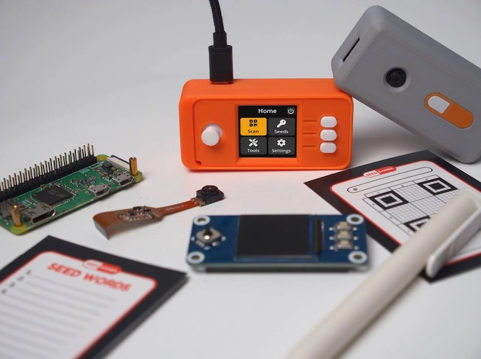

# Build an offline, airgapped Bitcoin signing device for less than $50!



---------------

* [Project Summary](#project-summary)
* [Shopping List](#shopping-list)
* [Software Installation](#software-installation)
  * [Verifying the Software](#verifying-the-software)
* [Enclosure Designs](#enclosure-designs)
* [SeedQR Printable Templates](#seedqr-printable-templates)
* [Build from Source](#build-from-source)
* [Developer Local Build Instructions](#developer-local-build-instructions)


---------------

# Project Summary

[](https://github.com/SeedSigner/seedsigner/actions/workflows/tests.yml)
[](https://github.com/SeedSigner/seedsigner/actions/workflows/build.yml)

The goal of SeedSigner is to lower the cost and complexity of Bitcoin multi-signature wallet use. To accomplish this goal, SeedSigner offers anyone the opportunity to build a verifiably air-gapped, stateless Bitcoin signing device using inexpensive, publicly available hardware components (usually < $50). SeedSigner helps users save with Bitcoin by assisting with trustless private key generation and multisignature (aka "multisig") wallet setup, and helps users transact with Bitcoin via a secure, air-gapped QR-exchange signing model.

Additional information about the project can be found at [SeedSigner.com](https://seedsigner.com).

You can follow [@SeedSigner](https://twitter.com/SeedSigner) on Twitter for the latest project news and developments.

If you have specific questions about the project, our [Telegram Group](https://t.me/joinchat/GHNuc_nhNQjLPWsS) is a great place to ask them.

### Feature Highlights:
* Calculate the final word (aka checksum) of a 12- or 24-word BIP39 seed phrase
* Create a 24-word BIP39 seed phrase with 99 dice rolls or a 12-word with 50 rolls [(Verifying dice seed generation)](docs/dice_verification.md)
* Create a 12- or 24-word BIP39 seed phrase via image entropy from the onboard camera 
* Temporarily stores seeds in memory while the device is powered; all memory is wiped when power is removed
* SD card removable after boot to ensure no secret data can be written to it
* Guided interface to manually transcribe a seed to the SeedQR format for instant seed loading [(demo video here)](https://youtu.be/c1-PqTNx1vc)
* BIP39 passphrase (aka "word 25") support
* Native Segwit Multisig XPUB generation
* PSBT-compliant; scan and parse transaction data from animated QR codes
* Sign transactions & transfer XPUB data using animated QR codes [(demo video here)](https://youtu.be/LPqvdQ2gSzs)
* Live preview during image entropy seed generation and QR scanning UX
* Optimized seed word entry interface
* Support for Bitcoin Mainnet & Testnet
* Support for custom user-defined derivation paths
* Support for loading Electrum Segwit seed phrases with feature limitations: [Electrum support info](docs/electrum.md)
* On-demand receive address verification
* Address Explorer for single sig and multisig wallets
* User-configurable QR code display density
* Responsive, event-driven user interface

### Considerations:
* Built for compatibility with Specter Desktop, Sparrow, and BlueWallet Vaults
* Device takes up to 60 seconds to boot before menu appears (be patient!)
* Always test your setup before transferring larger amounts of bitcoin (try Testnet first!)
* Taproot not quite yet supported
* Slightly rotating the screen clockwise or counter-clockwise should resolve lighting/glare issues
* If you think SeedSigner adds value to the Bitcoin ecosystem, please help us spread the word! (tweets, pics, videos, etc.)

### Planned Upcoming Improvements / Functionality:
* Multi-language support
* Significantly faster boot time
* Reproducible builds
* Port to MicroPython to broaden the range of compatible hardware to include low-cost microcontrollers
* Other optimizations based on user feedback!

---------------

# Shopping List

To build a SeedSigner, you will need:

* Raspberry Pi Zero (preferably version 1.3 with no WiFi/Bluetooth capability, but any Raspberry Pi 2/3/4 or Zero model will work, Raspberry Pi 1 devices will require a hardware modification to the Waveshare LCD Hat, as per the [instructions here](./docs/legacy_hardware.md))
* Waveshare 1.3" 240x240 pxl LCD (correct pixel count is important, more info at https://www.waveshare.com/wiki/1.3inch_LCD_HAT)
* Pi Zero-compatible camera (tested to work with the Aokin / AuviPal 5MP 1080p with OV5647 Sensor)

Notes:
* You will need to solder the 40 GPIO pins (20 pins per row) to the Raspberry Pi Zero board. If you don't want to solder, purchase "GPIO Hammer Headers" for a solderless experience.
* Other cameras with the above sensor module should work, but may not fit in the Orange Pill enclosure
* Choose the Waveshare screen carefully; make sure to purchase the model that has a resolution of 240x240 pixels

---------------

# Software Installation

## A Special Note On Minimizing Trust
As is the nature of pre-packaged software downloads, downloading and using the prepared SeedSigner release images means implicitly placing trust in the people preparing those images; in our project the released images are prepared and signed by the eponymous creator of the project, SeedSigner "the person". That individual is additionally the only person in possession of the PGP keys that are used to sign the release images.

Starting with v0.7.0, the images distributed via GitHub are reproducible. This means you and others can verify the released images are byte-for-byte the same when built from source. You can contribute to this project by building from source and sharing the hash of the final images.

Instructions to build a SeedSigner OS image (using precisely the same process that is used to create the prepared release images) have been made available. We have put a lot of thought and work into making these instructions easy to understand and follow, even for less technical users. These instructions can be found [here](https://github.com/SeedSigner/seedsigner-os/blob/main/docs/building.md).

## Downloading the Software

   
Download the current Version (0.8.0) software image that is compatible with your  Raspberry Pi Hardware. The Pi Zero 1.3 is the most common and recommended board.
| Board                 | Download Image Link/Name          |
| --------------------- | --------------------------------- |
|**[Raspberry Pi Zero 1.3](https://www.raspberrypi.com/products/raspberry-pi-zero/)**      |[`seedsigner_os.0.8.0.pi0.img`](https://github.com/SeedSigner/seedsigner/releases/download/0.8.0/seedsigner_os.0.8.0.pi0.img)      |
|[Raspberry Pi Zero W](https://www.raspberrypi.com/products/raspberry-pi-zero-w/)    |[`seedsigner_os.0.8.0.pi0.img`](https://github.com/SeedSigner/seedsigner/releases/download/0.8.0/seedsigner_os.0.8.0.pi0.img)      |
|[Raspberry Pi Zero 2 W](https://www.raspberrypi.com/products/raspberry-pi-zero-2-w/)  |[`seedsigner_os.0.8.0.pi02w.img`](https://github.com/SeedSigner/seedsigner/releases/download/0.8.0/seedsigner_os.0.8.0.pi02w.img)    |
|[Raspberry Pi 1 Model B/B+](https://www.raspberrypi.com/products/raspberry-pi-1-model-b-plus/) |[`seedsigner_os.0.8.0.pi0.img`](https://github.com/SeedSigner/seedsigner/releases/download/0.8.0/seedsigner_os.0.8.0.pi0.img)      |
|[Raspberry Pi 2 Model B](https://www.raspberrypi.com/products/raspberry-pi-2-model-b/) |[`seedsigner_os.0.8.0.pi2.img`](https://github.com/SeedSigner/seedsigner/releases/download/0.8.0/seedsigner_os.0.8.0.pi2.img)      |
|[Raspberry Pi 3 Model B](https://www.raspberrypi.com/products/raspberry-pi-3-model-b/) |[`seedsigner_os.0.8.0.pi02w.img`](https://github.com/SeedSigner/seedsigner/releases/download/0.8.0/seedsigner_os.0.8.0.pi02w.img)    |
|[Raspberry Pi 4 Model B](https://www.raspberrypi.com/products/raspberry-pi-4-model-b/) |[`seedsigner_os.0.8.0.pi4.img`](https://github.com/SeedSigner/seedsigner/releases/download/0.8.0/seedsigner_os.0.8.0.pi4.img)      |
|[Raspberry Pi 400](https://www.raspberrypi.com/products/raspberry-pi-400-unit/) |[`seedsigner_os.0.8.0.pi4.img`](https://github.com/SeedSigner/seedsigner/releases/download/0.8.0/seedsigner_os.0.8.0.pi4.img)      |

Note: If you have physically removed the WiFi component from your board, you will still use the image file of the original(un-modified) hardware. (Our files are compiled/based on the *processor* architecture). Although it is better to spend a few minutes upfront to determine which specific Pi hardware/model you have, if you are still unsure which hardware you have, you can try using the pi0.img file. Making an incorrect choice here will not ruin your board, because this is software, not firmware. 

**also download** these 2 signature verification files to the same folder  
[The Plaintext manifest file](https://github.com/SeedSigner/seedsigner/releases/download/0.8.0/seedsigner.0.8.0.sha256.txt)  
[The Signature of the manifest file](https://github.com/SeedSigner/seedsigner/releases/download/0.8.0/seedsigner.0.8.0.sha256.txt.sig)

Users familiar with older versions of the SeedSigner software might be surprised with how fast their software downloads now are, because since version 0.6.0 the software image files are now 100x smaller! Each image file is now under 42 Megabytes so your downloads and verifications will be very quick now (and might even seem *too* quick)!  

Once the files have all finished downloading, follow the steps below to verify the download before continuing on to write the software onto a MicroSD card. Next, insert the MicroSD into your assembled hardware and connect the USB power. Allow about 45 seconds for our logo to appear, and then you can begin using your SeedSigner! 

[Our previous software versions are available here](https://github.com/SeedSigner/seedsigner/releases). Choose a specific version and then expand the *Assets* sub-heading to display the .img file binary and also the 2 associated signature files. **Note:** The prior version files will have lower numbers than the scripts and examples provided in this document, but the naming format will be the same, so you can edit them as required for signature verification etc.   


## Verifying that the downloaded files are authentic (optional but highly recommended!)

You can quickly verify that the software you just downloaded is both authentic and unaltered, by following these instructions.
We assume you are running the commands from a computer where both [GPG](https://gnupg.org/download/index.html) and [shasum](https://command-not-found.com/shasum) are already installed, and that you also know [how to navigate on a terminal](https://terminalcheatsheet.com/guides/navigate-terminal). 

> You must run the following verification before opening or mounting the .img file.
> Some operating systems modify the file on mount causing verification to fail.

### Step 1. Verify that the signature (.sig) file is genuine:

Run GPG's *fetch-keys* command to import the SeedSigner projects public key from the popular online keyserver called *Keybase.io*, into your computers *keychain*. 


```
gpg --fetch-keys https://keybase.io/seedsigner/pgp_keys.asc
```
The result should confirm that 1 key was *either* imported or updated. *Ignore* any key ID's or email addresses shown.

  

Next, you will run the *verify* command on the signature (.sig) file. (*Verify* must be run from inside the same folder that you downloaded the files into earlier. The `*`'s in this command will auto-fill the version from your current folder, so it should be copied and pasted as-is.)   
```
gpg --verify seedsigner.0.7.*.sha256.txt.sig
```

When the verify command completes successfully, it should display output like this:
<BR>
  
The result must display "**Good signature**".  Ignore any email addresses - *only*  matching Key fingerprints count here. Stop immediately if it displays "*Bad signature*"!
<BR> 

On the *last* output line, look at your *rightmost* 16 characters (the 4 blocks of 4).  
**Crucially, we must now check WHO that Primary key fingerprint /ID belongs to.** We will start by looking at Keybase.io to see if it is the *SeedSigner project* 's public key or not.

<details><summary> About the warning message:</summary>
<p>  Since you are about to match the outputted fingerprint/ID against the proofs at Keybase.io/SeedSigner, and thereby confirm who the pubkey really belongs to-, you can safely ignore this warning message:

```
> WARNING: This key is not certified with a trusted signature!  
> There is no indication that the signature belongs to the owner.
 ```
</p>
</details>
<br>

<details><summary> More about how the verify command works:</summary>
<p>  
The verify command will attempt to decrypt the signature file (sha256.sig) by trying each public key already imported into your computer. If the public key we just imported (via fetch-keys), manages to: (a) successfully decrypt the .sig file , and (b), that result matches exactly to the clear-text equivalent (.sha256) of the .sig file, then its "a good signature"!   

Crucially, we must still manually check who *exactly* owns the Key ID which gave us that "Good signature". Thats what the warning message means- Who does the matching key really belong to? We will start by looking at keybase.io to see if it is "The SeedSigner project"'s public Key or not. 
Note that it is the file hashes of .sig and .sha256 that *verify* compares, not their raw contents.

</p>
</details>
<br>

Now to determine ***who*** the Public key ID belongs to: Goto [Keybase.io/SeedSigner](https://keybase.io/seedsigner)  
<BR>


**You must now *manually* compare: The 16 character fingerprint ID (as circled in red above) to, those *rightmost* 16 characters from your *verify* command.** 

**If they match exactly, then you have successfully confirmed that your .sig file is authentically from the SeedSigner Project!**
<BR>

<details><summary>Learn more about how keybase.io helps you check that someone (online) is who they say they are:</summary>
<p>
Keybase.io allows you to independently verify that the public key saved on Keybase.io, is both authentic and that it belongs to the organization it claims to represent.  
 Keybase has already checked the three pubkey file locations  cryptographically when they were saved there. You can further verify the key publications if you would like:  
 
 - *via Keybase*: By clicking on any of the three blue badges to see that the "proof" was published at that location. (The blue badge marked as tweet, is in the most human-readable form and it is also a bi-directional link on Twitter)    
or, 
 - *without keybase (out-of-band)*: By using these 3 links directly: [Twitter](https://twitter.com/SeedSigner/status/1530555252373704707), [Github](https://gist.github.com/SeedSigner/5936fa1219b07e28a3672385b605b5d2) and [SeedSigner.com](https://seedsigner.com/keybase.txt). This method can be used if you would like to make an even deeper, independent inspection without relying on Keybase at all, or if the Keybase.io site is no longer valid or it is removed entirely. 

Once you have used one of these methods, you will know if the Public Key stored on Keybase, is genuinely from the SeedSinger Project or not.
</p>
</details>
<br>

If the two ID's do *not* match, then you must stop here immediately. Do not continue. Contact us for assistance in the Telegram group address above.

<br>

### Step 2. Verifying that the *software images/binaries* are genuine

Now that you have confirmed that you do have the real SeedSigner Project's Public Key (ie the 16 characters match) - you can return to your terminal window. Running  the *shasum* command, is the final verification step and will confirm (via file hashing) that the software code/image files, were also not altered since publication, or even during your download process.  
(Prior to version 0.6.0  , your verify command will check the .zip file which contains the binary files.)

 **On Linux or OSX:** Run this command
```
shasum -a 256 --ignore-missing --check seedsigner.0.7.*.sha256.txt  
```

**On Windows (inside Powershell):** Run this command
```
CertUtil -hashfile  seedsigner_os.0.8.0.Insert_Your_Pi_Models_binary_here_For_Example_pi02w.img SHA256 
```
On Windows, you must then manually compare the resulting file hash value to the corresponding hash value shown inside the .SHA256 cleartext file.
 <BR>

Wait up to 30 seconds for the command to complete, and it should display:
```
seedsigner_os.0.7.x.[Your_Pi_Model_For_Example:pi02w].img: OK
```
**If you receive the "OK" message** for your **seedsigner_os.0.7.x.[Your_Pi_Model_For_Example:pi02w].img file**, as shown above, then your verification is fully complete!  
**All of your downloaded files have now been confirmed as both authentic and unaltered!** You can proceed to create/write your MicroSD card😄😄 !!     

If your file result shows "FAILED", then you must stop here immediately. Do not continue. Contact us for assistance at  the Telegram group address above.

<BR>

Please recognize that this process can only validate the software to the extent that the entity that first published the key is an honest actor, and their private key is not compromised or somehow being used by a malicious actor.
<BR>
<BR>


## Writing the software onto your MicroSD card

To write the SeedSigner software onto your MicroSD card, there are a few options available:   
| Application              | Description                                                                                                                                                  | Platform and official Source                                                         |
|--------------------------|--------------------------------------------------------------------------------------------------------------------------------------------------------------|--------------------------------------------------------------------------------------|
| Balena Etcher            | The application is called Etcher, and the company that wrote it is called Balena.  Hence *Etcher by Balena* or *Balena Etcher*                                                  | [Available for Windows, Mac and Linux](https://www.balena.io/etcher#download-etcher) |
| Raspberry Pi Imager      | Produced by the Raspberry Pi organization.                                                                                                                   | [Available for Windows, Mac and Linux](https://www.raspberrypi.com/software/)        |
| DD Command Line Utility  | Built-in to Linux and MacOS, the DD (Data Duplicator) is a tool for advanced users.  If not used carefully it can accidentally format the incorrect disk!   | Built-in to Linux and MacOS                                                        |

Be sure to download the software from the genuine publisher.  
Either of the Etcher or Pi Imager software is recommended.  Some SeedSigner users have reported a better experience with one or the other. So, if the one application doesn’t work well for your particular machine, then please try the other one. 
<BR>
### **General Considerations:** 
The writing and verify steps are very quick from version 0.6.0 upwards, so please pay close attention to your screen. 
Make sure to set any write-protection physical slider on the MicroSD Card Adapter to UN-locked.  
You also don’t need to pre-format the MicroSD beforehand.  You *dont* need to unzip any .zip file beforehand.
Current Etcher and Pi Imager software will perform a verify action (by default) to make sure the card was written successfully! Watching for that verify step to complete successfully, can save you a lot of headaches if you later need to troubleshoot issues where your SeedSigner device doesn’t boot up at power on.   
Writing the MicroSd card is also known as flashing.  
It will overwrite everything on the MicroSD card.  
If the one application fails for you, then please try again using our other recommended application.  
Advanced users may want to try the Linux/MacOS *DD* command instead of using Etcher or Pi Imager, however, a reminder is given that DD can overwrite the wrong disk if you are not careful !
#### **Specific considerations for Windows users:**
Use the Pi imager software as your first choice on Windows. Windows can sometimes flag the writing of a MicroSD as risky behaviour and hence it may prevent this activity. If this happens, your writing/flashing will fail, hang or wont even begin, in which case you should to try to run the Etcher/Pi-Imager app "As administrator", (right-click and choose that option). It can also be blocked by windows security in some cases, so If you have the (non-default) *Controlled Folder Access* option set to active, try turning that *off* temporarily. 


---------------

# Enclosure Designs

### Open Pill

The Open Pill enclosure design is all about quick, simple and inexpensive depoloyment of a SeedSigner device. The design does not require any additional hardware and can be printed using a standard FDM 3D printer in about 2 hours, no supports necessary. A video demonstrating the assembly process can be found [here](https://youtu.be/gXPFJygZobEa). To access the design file and printable model, click [here](https://github.com/SeedSigner/seedsigner/tree/main/enclosures/open_pill).

### Orange Pill

The Orange Pill enclosure design offers a more finished look that includes button covers and a joystick topper. You'll also need the following additional hardware to assemble it:

* 4 x F-F M2.5 spacers, 10mm length
* 4 x M2.5 pan head screws, 6mm length
* 4 x M2.5 pan head screws, 12mm length

The upper and lower portions of the enclosure can be printed using a standard FDM 3D printer, no supports necessary. The buttons and joystick nub should ideally be produced with a SLA/resin printer. An overview of the entire assembly process can be found [here](https://youtu.be/aIIc2DiZYcI). To access the design files and printable models, click [here](https://github.com/SeedSigner/seedsigner/tree/main/enclosures/orange_pill).

### Community Designs

* [Lil Pill](https://cults3d.com/en/3d-model/gadget/lil-pill-seedsigner-case) by @_CyberNomad
* [OrangeSurf Case](https://github.com/orangesurf/orangesurf-seedsigner-case) by @OrangeSurfBTC
* [PS4 SeedSigner](https://www.thingiverse.com/thing:5363525) by @Silexperience
* [OpenPill Faceplate](https://www.printables.com/en/model/179924-seedsigner-open-pill-cover-plates-digital-cross-jo) by @Revetuzo 
* [Waveshare CoverPlate](https://cults3d.com/en/3d-model/various/seedsigner-coverplate-for-waveshare-1-3-inch-lcd-hat-with-240x240-pixel-display) by @Adathome1

---------------

# SeedQR Printable Templates
You can use SeedSigner to export your seed to a hand-transcribed SeedQR format that enables you to instantly load your seed back into SeedSigner.

[More information about SeedQRs](docs/seed_qr/README.md)

<table align="center">
    <tr><td></td></tr>
</table>

Standard SeedQR templates:
* [12-word SeedQR template dots (25x25)](docs/seed_qr/printable_templates/dots_25x25.pdf)
* [24-word SeedQR template dots (29x29)](docs/seed_qr/printable_templates/dots_29x29.pdf)
* [12-word SeedQR template grid (25x25)](docs/seed_qr/printable_templates/grid_25x25.pdf)
* [24-word SeedQR template grid (29x29)](docs/seed_qr/printable_templates/grid_29x29.pdf)
* [Baseball card template: 24-word SeedQR (29x29)](docs/seed_qr/printable_templates/trading_card_29x29_w24words.pdf)

CompactSeedQR templates:
* [12-word CompactSeedQR template dots (21x21)](docs/seed_qr/printable_templates/dots_21x21.pdf)
* [24-word CompactSeedQR template dots (25x25)](docs/seed_qr/printable_templates/dots_25x25.pdf)
* [12-word CompactSeedQR template grid (21x21)](docs/seed_qr/printable_templates/grid_21x21.pdf)
* [24-word CompactSeedQR template grid (25x25)](docs/seed_qr/printable_templates/grid_25x25.pdf)
* [Baseball card template: 12-word Compact SeedQR (21x21)](docs/seed_qr/printable_templates/trading_card_21x21_w12words.pdf)
* [Baseball card template: 24-word Compact SeedQR (25x25)](docs/seed_qr/printable_templates/trading_card_25x25_w24words.pdf)


2-sided SeedQR templates - 8 per sheet
Printing settings - (2-sided)("flip on long edge")("Actual Size")
If printing on cardstock, adjust your printer settings via its control panel

A4 templates(210mm * 297mm):
* [21x21 - stores 12-word seeds ONLY in CompactSeedQR format ONLY](docs/seed_qr/printable_templates/21x21_A4_trading_card_2sided.pdf)
* [25x25 - stores 12-word or 24 word seeds depending on SeedQR format](docs/seed_qr/printable_templates/25x25_A4_trading_card_2sided.pdf)
* [29x29 - stores 24-word seeds ONLY as plaintext SeedQR format ONLY](docs/seed_qr/printable_templates/29x29_A4_trading_card_2sided.pdf)

Letter templates(8.5in * 11in):
* [21x21 - stores 12-word seeds ONLY in CompactSeedQR format ONLY](docs/seed_qr/printable_templates/21x21_letter_trading_card_2sided.pdf)
* [25x25 - stores 12-word or 24 word seeds depending on format](docs/seed_qr/printable_templates/25x25_letter_trading_card_2sided.pdf)
* [29x29 - stores 24-word seeds ONLY as plaintext SeedQR format ONLY](docs/seed_qr/printable_templates/29x29_letter_trading_card_2sided.pdf)
---------------

# Build from Source
See the [SeedSigner OS repo](https://github.com/SeedSigner/seedsigner-os/) for instructions.

# Developer Local Build Instructions
Raspberry Pi OS is commonly used for development. See the [Raspberry Pi OS Build Instructions](docs/raspberry_pi_os_build_instructions.md)
