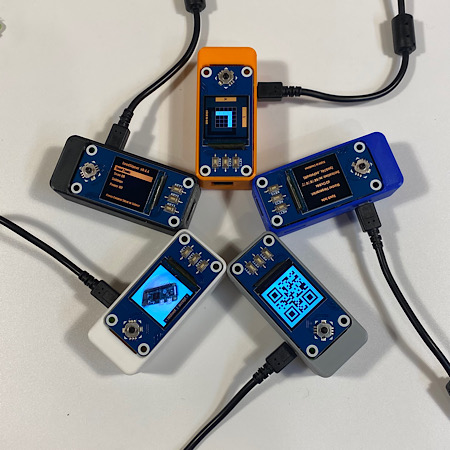

# Build an offline, airgapped Bitcoin signing device for less than $50!



---------------

* [Project Summary](#project-summary)
* [Shopping List](#shopping-list)
* [Software Installation](#software-installation)
  * [Verifying Your Software](#verifying-your-software)
* [Enclosure Designs](#enclosure-designs)
* [SeedQR Printable Templates](#seedqr-printable-templates)
* [Manual Installation Instructions](#manual-installation-instructions)


---------------

# Project Summary

The goal of SeedSigner is to lower the cost and complexity of Bitcoin multi-signature wallet use. To accomplish this goal, SeedSigner offers anyone the opportunity to build a verifiably air-gapped, stateless Bitcoin signing device using inexpensive, publicly available hardware components (usually < $50). SeedSigner helps users save with Bitcoin by assisting with trustless private key generation and multi-signature wallet setup, and helps users transact with Bitcoin via a secure, air-gapped QR-exchange signing model.

Additional information about the project can be found at [seedsigner.com](https://seedsigner.com).

You can follow [@SeedSigner](https://twitter.com/SeedSigner) on Twitter for the latest project news and developments.

If you have specific questions about the project, our [Telegram Group](https://t.me/joinchat/GHNuc_nhNQjLPWsS) is a great place to ask them.

### Feature Highlights:
* Calculate word 12/24 of a BIP39 seed phrase
* Create a 24-word BIP39 seed phrase with 99 dice rolls
* Create a 24-word BIP39 seed phrase by taking a digital photo 
* Temporarily store up to 3 seed phrases while device is powered
* Guided interface to manually create a SeedQR for instant input [(demo video here)](https://youtu.be/c1-PqTNx1vc)
* BIP39 passphrase / word 25 support
* Native Segwit Multisig XPUB generation w/ QR display
* Scan and parse transaction data from animated QR codes
* Sign transactions & transfer XPUB data using animated QR codes [(demo video here)](https://youtu.be/LPqvdQ2gSzs)
* Live preview during photo-to-seed and QR scanning UX
* Optimized seed word entry interface
* Support for Bitcoin Mainnet & Testnet
* Support for custom user-defined derivation paths
* On-demand receive address verification
* User-configurable QR code display density
* Responsive, event-driven user interface

### Considerations:
* Built for compatibility with Specter Desktop, Sparrow, and BlueWallet Vaults
* Device takes up to 60 seconds to boot before menu appears (be patient!)
* Always test your setup before transfering larger amounts of bitcoin (try testnet first!)
* Taproot not quite yet supported
* Slightly rotating the screen clockwise or counter-clockwise should resolve lighting/glare issues
* If you think SeedSigner adds value to the Bitcoin ecosystem, please help us spread the word! (tweets, pics, videos, etc.)

### Planned Upcoming Improvements / Functionality:
* Single-sig and multi-sig change address verification
* Re-imagined, graphically-focused user interface
* Multi-language support
* Customized Linux live-boot OS to allow MicroSD card removal
* Other optimizations based on user feedback!

---------------

# Shopping List

To build a SeedSigner, you will need:

* Raspberry Pi Zero (preferably version 1.3 with no WiFi/Bluetooth capability, but any Raspberry Pi 2/3/4 or Zero model will work)
* Waveshare 1.3" 240x240 pxl LCD (correct pixel count is important, more info at https://www.waveshare.com/wiki/1.3inch_LCD_HAT)
* Pi Zero-compatible camera (tested to work with the Aokin / AuviPal 5MP 1080p with OV5647 Sensor)

Notes:
* You will need to solder the 40 GPIO pins (20 pins per row) to the Raspberry Pi Zero board. If you don't want to solder, purchase "GPIO Hammer Headers" for a solderless experience.
* Other cameras with the above sensor module should work, but may not fit in the Orange Pill enclosure
* Choose the Waveshare screen carefully; make sure to purchase the model that has a resolution of 240x240 pixels

---------------

# Software Installation
The quickest and easiest way to install the software is to download the most recent "seedsigner_X_X_X.zip" file in the [software releases](https://github.com/SeedSigner/seedsigner/releases) section of this repository.

After downloading the .zip file, extract the seedsigner .img file, and write it to a MicroSD card (at least 4GB in size or larger). Then install the MicroSD in the assembled hardware and off you go. If your goal is a more trustless installation, you can follow the [manual installation instructions](docs/manual_installation.md).

## Verifying Your Software
You can verify the data integrity and authenticity of the latest release with as little as three commands (though moving forward you will have to replace the version in the following commands with the version number you are attempting to validate). This process assumes that you have navigated to a folder where you have these four relevant files present:

* seedsigner_pubkey.gpg (from the main folder of this repo)
* seedsigner_0_4_5.img.zip (from the software release)
* seedsigner_0_4_5.img.zip.sha256 (from the software release)
* seedsigner_0_4_5.img.zip.sha256.sig (from the software release)

This process also assumes you are running the commands from a system where both GPG and shasum are installed and working.

First make sure that the public key is present in your keychain:
```
gpg --import seedsigner_pubkey.gpg 
```
This command will import the public key, or return:
```
key <...> not changed
```

Now you can verify the authenticity of the small text file containing the release's SHA256 hash with the command:
```
gpg --verify seedsigner_0_4_5.img.zip.sha256.sig
```
The reponse to this command should include the text:
```
Good signature from "seedsigner <btc.hardware.solutions@gmail.com>" [unknown]
```
The previous command validates that aforementioned small text file was signed using the private key that matches the published public key associated with the project (an early timestamped record of this public/private key's creation can be found in this [tweet](https://twitter.com/SeedSigner/status/1389617642286329856?s=20)).

The last step is to make sure the .zip file that you've downloaded, and that contains the released software, is a perfect match to the software that was published by the holder of the private key in the last step. The command for this step is:
```
shasum -a 256 -c seedsigner_0_4_5.img.zip.sha256
```
The reponse to this command should include the text:
```
seedsigner_0_4_5.img.zip: OK
```

There are other steps you can take to verify the software, including examining the hash value in the .sha256 text file, but this one has been documented here because it seems the simplest for most people to follow. Please recognize that this process can only validate the software to the extent that the entity that first published the key is an honest actor, and assumes the private key has remained uncompromised and is not being used by a malicious actor.

---------------

# Enclosure Designs

### Open Pill

The Open Pill enclosure design is all about quick, simple and inexpensive depoloyment of a SeedSigner device. The design does not require any additional hardware and can be printed using a standard FDM 3D printer in about 2 hours, no supports necessary. A video demonstrating the assembly process can be found [here](https://youtu.be/gXPFJygZobEa). To access the design file and printable model, click [here](https://github.com/SeedSigner/seedsigner/tree/main/enclosures/open_pill).

### Orange Pill

The Orange Pill enclosure design offers a more finished look that includes button covers and a joystick topper. You'll also need the following additional hardware to assemble it:

* 4 x F-F M2.5 spacers, 10mm length
* 4 x M2.5 pan head screws, 6mm length
* 4 x M2.5 pan head screws, 12mm length

The upper and lower portions of the enclosure can be printed using a standard FDM 3D printer, no supports necessary. The buttons and joystick nub should ideally be produced with a SLA/resin printer. An overview of the entire assembly process can be found [here](https://youtu.be/aIIc2DiZYcI). To access the design files and printable models, click [here](https://github.com/SeedSigner/seedsigner/tree/main/enclosures/orange_pill).

---------------

# SeedQR Printable Templates
You can use SeedSigner to export your seed to a hand-transcribed SeedQR format that enables you to instantly load your seed back into SeedSigner.

[More information about SeedQRs](docs/seed_qr/README.md)

<table align="center">
    <tr><td></td></tr>
</table>

Standard SeedQR templates:
* [12-word SeedQR template (25x25)](docs/seed_qr/printable_templates/12words_seedqr_template.pdf)
* [24-word SeedQR template (29x29)](docs/seed_qr/printable_templates/24words_seedqr_template.pdf)
* [Baseball card template: 24-word SeedQR (29x29)](docs/seed_qr/printable_templates/Seed_QR_Card.pdf)

CompactSeedQR templates:
* [12-word CompactSeedQR template (21x21)](docs/seed_qr/printable_templates/compact_seedqr/12words_compactseedqr_template.pdf)
* [24-word CompactSeedQR template (25x25)](docs/seed_qr/printable_templates/compact_seedqr/24words_compactseedqr_template.pdf)

_note: CompactSeedQR is an advanced feature that can be enabled in Settings_

---------------

# Manual Installation Instructions
see the docs: [Manual Installation Instructions](docs/manual_installation.md)
