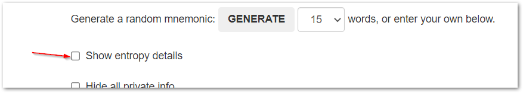
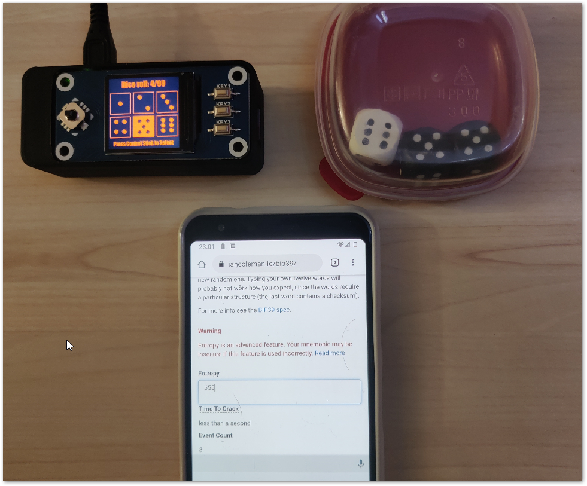
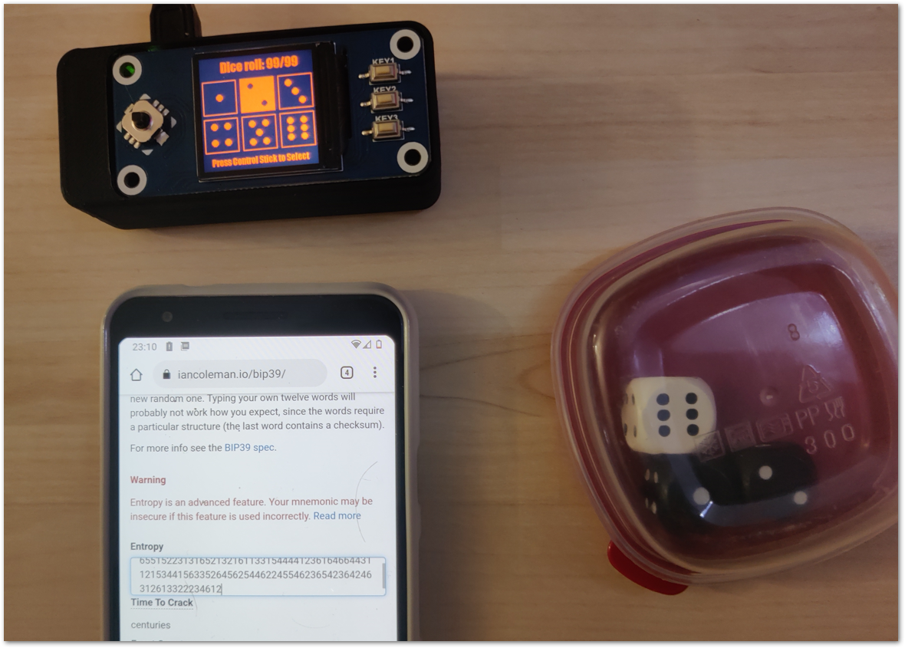
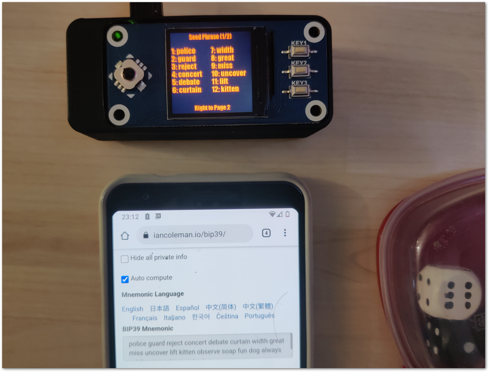

## Verifying dice seed generation 

It is possible to do a 'dry run' to verify that seed generation has not been tempered.
This will ensure that the derivation algorithm has not been tempered and is still same as well known algorithm used bu coldcard and ian coleman bip39 webpage.
For example an 'evil maid' attack would be someone accesing your sdcard and change the code to only take in account 5 or 6 dice, so the 24 words would still feel random but the attacker will need to brute force only 5 or 6 dice (very easy).
This is part of the "do not trust, verify" crypto mottos.

### Verifying with Ian coleman webpage

Go to https://iancoleman.io/bip39 and check show entropy detail:

And then make sure to check 'Hex' or 'base 10' (1) and 24 words as mnemonic length (2).
Do not use 'dice' format because dice 6 will be replaced by 0.
And then enter the 99 dices numbers in (3) :

When the 99 dice number has been entered in the seedsigner and ian coleman page, you will be able to verify that the 24 words are the same.

#### Here in real life:

We start with first 3 roll, it is important to always read dice roll from left to right to avoid human bias:

Then we arrive at the 99th dice:

Then same 24 words! :

Now we are sure that the dice derivation is correct and we can unplug everything and do a new dice roll only on the seedsigner.

### Verifying with Coldcard

There is nothing specific, the algorithm are completely the same. Coldcard has a verification script in python and all explanations here:
https://coldcard.com/docs/verifying-dice-roll-math

### Epilogue
You can use these methods to do dry run time to time to verify that no one has changed the micro sdcard. But do not use the generated 24 words as a valid wallet, they need to be generated alone, only on the seedsigner!
