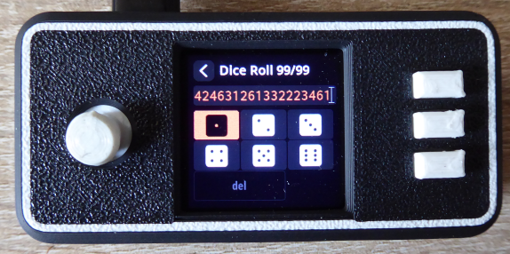

# Verifying dice seed generation 

The intention of this documentation is to describe how to verify the seed generation code used in SeedSigner against other independent tools, to prove that they all generate the same results, despite them using different programming languages and code libraries.<br><br>
As it is an important step to verify all software releases being used to ensure that the installation files downloaded have not been compromised, the same is true especially for the seed generation procedure which unknowingly might not work as expected due to bugs or even on purpose.<br><br>
This guide describes how this can be achieved.<br><br>
As usual: Don't Trust, Verify!<br>
<br><br>
**Note:**<br>
**Do NOT use this with any seed you want to use later with real funds. This exercise is only for checking that the independent codebases get to the same end result!**<br>
**However, if you do want to check your real seedphrases you should download the Iancoleman and/or Bitcoiner.Guide tools onto an airgapped, ephemeral computer (e.g. using tails-OS) and perform these tests on there. Destroy/abandon the TailsOS afterwards.**<br>
**Never input seed phrases that you intend to use to store real funds onto an internet-connected computer!!!**
<br><br><br>

## 99 Dice Rolls / 24 Seed Words Example

The following 99 dice roll results are used in the verification steps as an example for a 24 words seed:<br>
> 655152231316521321611331544441236164664431121534415633526456254462245546236542364246312613322234612

The corresponding 24 seed words are:<br>
> eyebrow obvious such suggest poet seven breeze blame virtual frown dynamic donor harsh pigeon express broccoli easy apology scatter force recipe shadow claim radio

(Scroll down near the end to see result values for a 50 dice rolls / 12 seed words example)
<br><br><br>

## Creating seed via Dice rolls in SeedSigner (here v0.6.0)

First we create a new seed based on dice rolls in SeedSigner:<br><br>
Power on your SeedSigner, go to the 'Tools' menu and select 'New Seed' (with the dice symbols):<br>


Select '24 words (99 rolls)' and on the next screen enter the dice numbers one after another:<br>


Go on until the end (99 dice roll numbers):<br>


After that the 24 seed words are shown (in 6 screens of 4 words each):<br>

<br>**.....**<br>


The fingerprint for this seed is:<br>

<br><br><br>
Having now created a dice-based seed in the SeedSigner, we will go on to compare those details to what appears in the:
* Sparrow desktop wallet software
* Ian Coleman's Mnemonic Code Converter website
* Seed Tool website

We will create a wallet to have the complete zpub and receive/change addresses to check against the two web pages.<br>
SeedSigner currently supports BlueWallet, Nunchuk, Sparrow and Specter Desktop. Here we will use Sparrow wallet as an example.<br>

Keep the SeedSigner open and the newly created seed still loaded as we will need it in the next step.
<br><br><br>

## Create new wallet from seed in Sparrow Wallet to see xpub/zpub and addresses

Go to https://www.sparrowwallet.com/download/ and download the release version supported by your operating system.<br><br>
Open Sparrow Wallet, go to 'File' menu and select 'New Wallet'. Enter a name (e.g. test), and click 'Create Wallet'.<br><br>
Click 'Airgapped Hardware Wallet' (1) and click on the 'Scan' button in the SeedSigner entry (2) which will open the camera scan screen:<br>
<kbd></kbd>

On SeedSigner go to the seed just created and click 'Export Xpub':<br>


Follow these menu entries in SeedSigner:<br>
> Export Xpub --> Single Sig --> Native Segwit --> Sparrow<br>


Click 'Export Xpub' and SeedSigner will show an animated QR code to be scanned in Sparrow Wallet (where we are still in the wallet creation).<br>
Scan the QR code SeedSigner is showing in Sparrow Wallet.<br><br>
The wallet has now been created in Sparrow. Click 'Apply' button to finalize. The wallet's settings screen now looks like this:<br>
<kbd></kbd>

We will later use this to verify: (1) fingerprint, (2) zpub (click this button to switch between xpub and zpub!) and (3) addresses on the 'Addresses' tab.
<br><br><br>

## Verifying with Ian Coleman BIP39 website

Go to https://iancoleman.io/bip39 and check 'Show entropy details' (1):<br>
<kbd></kbd>

<br>
Make sure to check (1) 'Hex' and (2) '24 Words' as 'Mnemonic Length'.<br>
(Do not use 'dice' format because dice 6 will be replaced by 0).<br>
Then enter the 99 dices numbers in (3). The corresponding seed words are shown in (4):<br>
<kbd></kbd>
<br><br>
The 24 seed words are the same in SeedSigner and the Ian Coleman tool.
<br><br>

### Verification of (1) fingerprint, (2) zpub and (3) generated addresses
**Fingerprint:**<br>
Fingerprint is not shown in the Ian Coleman tool (so cannot be verified here)
<br><br>
**Zpub:**<br>
Scroll down to the 'Derivation Path' section, click on the 'BIP84' tab (1) and find the zpub in (2):
<kbd></kbd><br><br>
Compare to zpub in Sparrow:<br>
<kbd></kbd>
<br>

Zpub is the same as shown in SeedSigner and Sparrow wallet.
<br><br>
**Addresses:**<br>
Scroll down to the 'Derived Addresses' section and compare the receive addresses to the ones generated in Sparrow ('Addresses' tab of the wallet):
<kbd></kbd>
<br>

Check that the receive addresses all match.<br><br>
To verify the change addresses, change 'External / Internal' to 1 (1):
<kbd></kbd><br><br>
Compare the change addresses to the ones generated in Sparrow ('Addresses' tab of the wallet):
<kbd></kbd>
<br>

Check that the change addresses all match.
<br><br><br>

## Verifying with Seed Tool website

Go to https://bitcoiner.guide/seed/ and click on 'Seed Generation Input' (1):<br>
<kbd></kbd>

Then click on the 'Show the Entropy Section' tab (1):<br>
<kbd></kbd>

Enter the 99 dice numbers in (1), in (2) change back to 'Hex', check that (3) is still '24 Words' and the calculated seed words are shown in (4):<br>
<kbd></kbd>

Seed words shown are the same as in SeedSigner and the Ian Coleman web tool seen before.
<br><br>

### Verification of (1) fingerprint, (2) zpub and (3) generated addresses

**Fingerprint:**<br>
Fingerprint can be seen here (1): <br>
<kbd></kbd><br><br>
**Zpub:**<br>
Scroll down to the 'Derived Addresses' section (1), click on it, make sure that '84' is selected for 'Purpose' (2) and check the zpub at (3):<br>
<kbd></kbd><br><br>
Compare to zpub in Sparrow:<br>
<kbd></kbd>
<br>

Zpub is the same as shown in SeedSigner, Sparrow and Ian Colemand tool.
<br><br>
**Addresses:**<br>
Scroll down a little bit where the receive addresses are shown and compare to the ones generated in Sparrow ('Addresses' tab of the wallet):<br>
<kbd></kbd>
<br>

Check that the receive addresses all match.<br><br>
To verify the change addresses, change the 'Receive/Change' dropdown box to '1 (Change)' (1):
<kbd></kbd><br><br>
Compare the change addresses to the ones generated in Sparrow ('Addresses' tab of the wallet):
<kbd></kbd>
<br>

Check that the change addresses all match.
<br><br><br>

## 50 Dice Rolls / 12 Seed Words Example

SeedSigner supports the creation of mnenomic seeds both with 12 or 24 seed words corresponding to 50 or 99 dice rolls. Below are some example result values for using 50 dice rolls only.<br><br>
All the steps shown can be executed the same way, just select the '12 words (50 rolls)' option in SeedSigner and change the 'Mnenomic Length' dropdown boxes in both web tools to '12 Words'.<br><br>

50 dice roll results as an example for a 12 words seed:<br>
> 65515223131652132161133154444123616466443112153441

The corresponding 12 seed words are:<br>
> hole luggage safe present express tragic orbit shed switch metal identify path

Fingerprint:<br>
> 8d9cced8

Zpub:<br>
> zpub6qf9ziL759pzyhKMWaPfNSiCETkoA6oq3fbCDvXqcURiMtPnkEg3nH93W5mrSkvGPoJC9xTYZheYDsYoiYc5AkSk9iY3DkCJHkFgHMdijW6

Addresses:<br>
Receive:<br>
> bc1q00lln3r4mt4uwvg7mxv96xgpewauwmggkex2ff<br>
> bc1q0jj2cv965f3642mv4lgq5za80jtfpkd0jhjefr<br>
> bc1qpecssejm2678v0rknk9tsxd5fsshezfr0vr5m5<br>
> bc1qcsl37xn5rkfz8qhcfwq5u52acxecyyfz0kv4gh<br>
> bc1q8ehx53re0wck4m9tzek8mlnctp2ztm7jq94zm4<br>
> ...<br>

Change:<br>
> bc1qz0ckhg3m349qpmweyn5v6r6tvx2wfw4nv8h75q<br>
> bc1qme5tu2t424ws3z69u445q0yw88vpc7fwygra4r<br>
> bc1qznuyuc087ky7fhv4nvlmll4p586ks4ggcyt36d<br>
> bc1qjcqxv22j0g00pehruwwh34sw5znu6vp3myaspy<br>
> bc1q6dpfl7czd22wt0max6p09vr6lvvpag7xw9u8lc<br>
> ...

<br><br>
## Conclusion

What did we achieve now?<br>

We created a dice-based seed in SeedSigner and set up a wallet using this seed in Sparrow wallet (as this is what a seed is used for).<br><br>
We double-checked in two different web tools implementing different methods for seed creation that what SeedSigner generates perfectly matches up with what the other tools calculate based on the same dice entropy used.<br>

So congratulations if the fingerprints, zpubs and addresses all match up in your example so you can be much more confident that nothing is wrong with your generated seed.

---

# Command Line Tool
_(for more advanced/python-savvy users)_

Run the exact same SeedSigner mnemonic generation code from the command line to quickly test and externally verify the results.

Create a python virtualenv (out of the scope of this doc) and install dependencies:
```bash
pip3 install embit

# Install the main project code to make it importable
pip3 install -e .
```


Then run the utility script with `-h` to view the usage instructions:
```bash
cd tools
python3 mnemonic.py -h
```

```
    Verify SeedSigner's dice rolls and coin flip entropy-to-mnemonic conversion via this tool.

    Compare its results against iancoleman.io/bip39 and bitcoiner.guide/seed

    Usage:
        # 50 dice rolls / 12-word mnemonic
        python3 mnemonic.py dice 5624433434...
        
        # 99 dice rolls / 24-word mnemonic
        python3 mnemonic.py dice 6151463561...

        # 50 dice rolls, entered as 0-5 / 12-word mnemonic
        python3 mnemonic.py --zero-indexed-dice dice 5135535514...

        # 128 coin flips / 12-word mnemonic
        python3 mnemonic.py coins 1111100111...

        # 256 coin flips / 24-word mnemonic
        python mnemonic.py coins 0010111010...

        # GENERATE 50 random dice rolls / 12-word mnemonic
        python3 mnemonic.py dice rand12

        # GENERATE 99 random dice rolls / 24-word mnemonic
        python3 mnemonic.py dice rand24

        # GENERATE 99 random dice rolls, entered as 0-5 / 24-word mnemonic
        python3 mnemonic.py --zero-indexed-dice dice rand24

        # GENERATE 128 random coin flips / 12-word mnemonic
        python3 mnemonic.py coins rand12

        # GENERATE 256 random coin flips / 24-word mnemonic
        python3 mnemonic.py coins rand24
```

### How to get the same results in iancoleman.io
Always specify your expected length in the "Mnemonic Length" droplist (defaults to "Use Raw Entropy (3 words per 32 bits)").

Dice Rolls: Do NOT use the "Dice [1-6]" option; select "Base 10 [0-9]" or "Hex [0-9A-F]"

Zero-indexed dice rolls: Select "Base 6 [0-5]", "Base 10 [0-9]", or "Hex [0-9A-F]"

Coin Flips: Select "Binary [0-1]", "Base 6 [0-5]", "Base 10 [0-9]", or "Hex [0-9A-F]"
