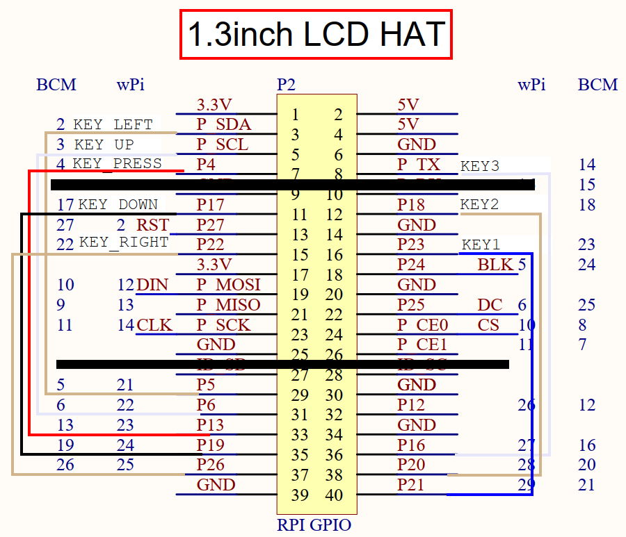
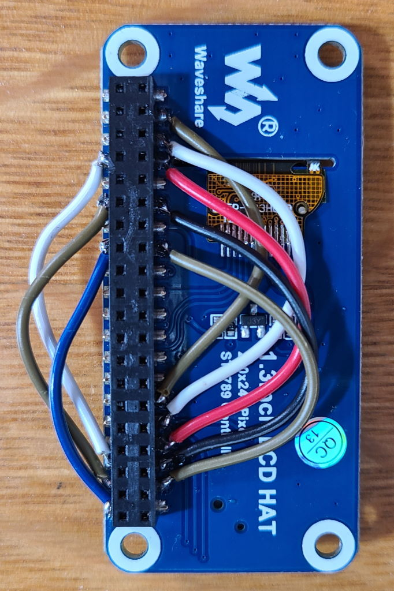

# Legacy Hardware Modifications

Older Raspberry Pi devices have a smaller GPIO header, 26 pin as opposed to the 40 pin header found on more recent models. The Waveshare LCD hat uses some of the pins between 26 and 40 for the buttons, meaning that these will need to be reassigned (and remapped in software) when used with an older device.

## Hardware Changes

A suggested remapping can be found here:

This remapping can be done by soldering wires on to the Waveshare hat as below:

Alternatively, you could do this by connecting the LCD hat on with individual breadboard jumper wires.

Once you have re-mapped the pins, it is advised to do an IO Test to ensure that everything works.

**Warning: Some of the GPIO pins on contain 5 volt output. Raspberry Pi GPIO pins are NOT 5V tolerant, meaning that if you accidentally connect a 5V supply pin to a GPIO input pin, you risk permanent damage.**

## Software Changes
The Seedsigner software will automatically detect which hardware revision you are using and if the older hardware is detected, will remap the software to match the above modifications to the Waveshare hat.

If you are using a pre-built Seedsigner image that hasn't yet has this incorporated, you can simply take the file "buttons.py" (/src/seedsigner/hardware/ int his repository) and overwrite same file on your Seedsigner SD card. (The easiest way to do this is to copy it on to the /boot/ partitition of the SD card then copy it over via the command line while connected to your Pi via monitor+keyboard) O