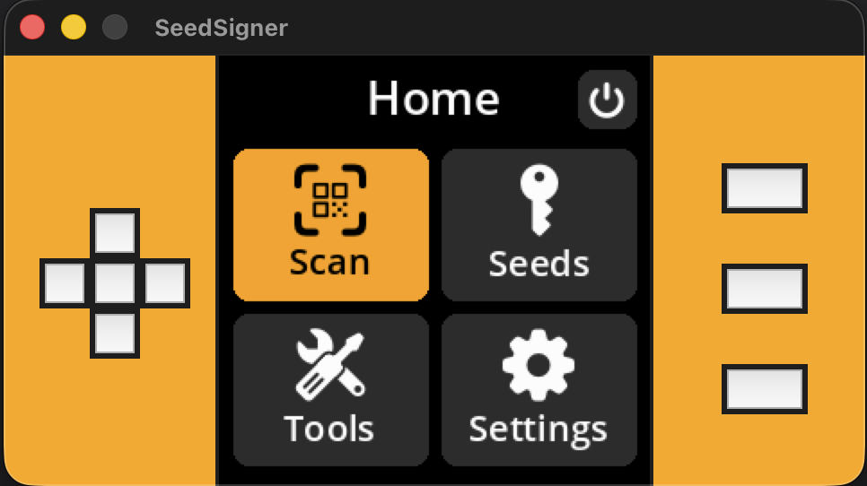

# Local SeedSigner Simulator Setup

This guide adds a method to setup SeedSigner testing locally through a simulator GUI for easy development. You can either interact with the buttons at the window or use keyboard arrows, Enter, Numpad_1, Numpad_2, Numpad_3

Note: The has only been tested on macOS (26) using Homebrew and Python 3.14.



---

### Prerequisites

- A desktop / laptop with webcam

---

### Installing system dependencies

SeedSigner’s simulator depends on Python with `tkinter` support, native libraries for QR scanning and camera access.
- `tkinter` is Python's built-in library for creating desktop GUI applications.
- `pyzbar` library requires a backend to be running on the system called `zbar`.

#### MacOS (Homebrew)
```bash
brew install python@3.14 # includes tkinter support
brew install zbar
```
#### Linux
```bash
sudo apt-get install python3-tk
sudo apt install libzbar0
```

### Setting up dev environment

```bash
git clone https://github.com/SeedSigner/seedsigner

python3 -m venv env
source env/bin/activate

# should not fail loading tkinter
python3 -m tkinter

pip install -r tools/emulator/requirements-simulator.txt
```

#### Camera Permissions (macOS Security)

On first run, macOS will block camera access. You may see logs like:

```
OpenCV: not authorized to capture video
OpenCV: camera failed to properly initialize
```

#### Grant Camera Permission (macOS)

Go to: System Settings → Privacy & Security → Camera

Enable camera access for:

- Terminal (if you run from Terminal)
- VS Code (if you run from VS Code)

Then restart Terminal and rerun the simulator.

You can also reset permissions if macOS didn’t prompt:

```bash
tccutil reset Camera
```

### Running the Simulator

```bash
python tools/emulator/run_emulator.py
```

### Notes

- The simulator environment is **not security-hardened** and should never be used with real funds.
- Camera access, QR decoding, and GUI rendering are all platform-dependent; macOS quirks differ from Raspberry Pi OS.
- For hardware deployment, follow the official Raspberry Pi OS instructions in the main project README.

### Credits

- The original work is inspired by https://github.com/enteropositivo/seedsigner-emulator, which was the first working emulator POC that directly replaced files in the SeedSigner source code for the camera, buttons, and renderer using Tkinter-based implementations.
- The modified work from https://github.com/ltcmweb/seedsigner based on @enteropositivo's work added macOS support with local emulation of the GPIO socket.
