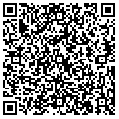
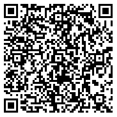
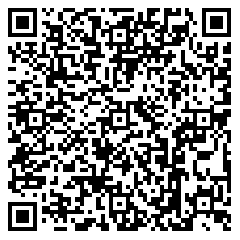
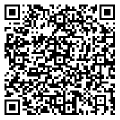
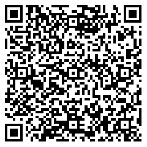

# QR Formats

### Scanning QR Codes

LumenSigner supports scanning the following QR formats

Animated QR Formats:
- Sign Transaction Envelope Request

    When requesting a transaction signature, if all information is contained in a single QR code, the Raspberry Pi camera may be difficult to read it successfully. Therefore, I recommend storing it in multiple QR codes and displaying them in a loop until the LumenSigner has read all QR codes. Here is an example:
    ```
    p1of4;sign-transaction;m/44'/148'/0';AAAAAgAAAACCfNHArCC/mgGCcbFHn9sg/f20zwTGgAZ85/lUZk/7ZwAAAGQACFT6dq
    ```
    ```
    p2of4;sign-transaction;
    90FAAAAAEAAAAAAAAAAAAAAABkeZprAAAAAAAAAAEAAAAAAAAAAQAAAADrOSiBrkIAwb25qGY1tlTlwE
    ```
    ```
    p3of4;sign-transaction;5fTwf2xn8c0WcKLI450AAAAAFVU0RDAAAAAEI+fQXy7K+/7BkrIVo/G+lq7bjY5wJUq+NBPgIH3layAA
    ```
    ```
    p4of4;sign-transaction;AAHLCyO7gAAAAAAAAAAA==;Test SDF Network ; September 2015
    ```
    We have divided a transaction request into four QR codes, represented by `p1of4`, `p2of4`, `p3of4`, and `p4of4`. `p1of4` represents that there are four QR codes, and this is the first one. `sign-transaction` indicates that this is a transaction signature request. `m/44'/148'/0'` represents the derivation path of your wallet. `AAAAAgAAAACCfNHArCC/mgGCcbFHn9sg/f20zwTGgAZ85/lUZk/7ZwAAAGQACFT6dq` is a part of `TransactionEnvelope`, which can be combined with the data in the following QR codes to form a complete `TransactionEnvelope`. `Test SDF Network ; September 2015` is the network passphrase. Therefore, `[DerivationPath];[TransactionEnvelope];[NetworkPassphrase]` are divided into multiple QR codes.

    You can use your LumenSigner to scan the four images below to see what happens.

    

Static QR Formats:
- Get Address request

    You can request address from LumenSigner by scanning a QR code with the following format:
    ```
    request-address;m/44'/148'/0'
    ```
    `request-address` indicates that this is a request for address. `m/44'/148'/0'` represents the derivation path of your wallet. 
    
    You can use your LumenSigner to scan the image below to see what happens.

    

- Sign Transaction Hash Request

    You can request transaction hash signature from LumenSigner by scanning a QR code with the following format:
    ```
    sign-hash;m/44'/148'/0';3389e9f0f1a65f19736cacf544c2e825313e8447f569233bb8db39aa607c8889
    ```

    `sign-hash` indicates that this is a request for transaction hash signature. `m/44'/148'/0'` represents the derivation path of your wallet. `3389e9f0f1a65f19736cacf544c2e825313e8447f569233bb8db39aa607c8889` is the transaction hash to be signed.

    You can use your LumenSigner to scan the image below to see what happens.

    

- Seed
    - [LumenSigner SeedQR](seed_qr/README.md) format
        - A 48 or 96 length string of numbers representing a bip39 wordlist (all wordlist languages supported). The numeric sequence is a concatenation of four-digit, zero-padded segments. Each four-digit segment represents a bip39 word expressed by a zero-indexed position in the wordlist. For example "0000" is abandon in the english bip39 wordlist.
    - [LumenSigner CompactSeedQR](seed_qr/README.md) format
        - The 128- or 256-bit entropy encoded as a binary QR.
	- English Bip39 Mnemonic words separated by a space. Currently only supports 12 and 24 word seeds.
	- English Bip39 Mnemonic with only first 4 letters seperated by a space. Currently only supports 12 and 24 word seeds.


### Displaying QR Codes

LumenSigner supports displaying QR's in the following formats

Static QR Formats:
- Address

    The information contained in the QR code is the address of the wallet.

    ```
    address;m/44'/148'/0';GCBHZUOAVQQL7GQBQJY3CR473MQP37NUZ4CMNAAGPTT7SVDGJ75WPTLH
    ```

    `address` indicates that this is an address. `m/44'/148'/0'` represents the derivation path of your wallet. `GCBHZUOAVQQL7GQBQJY3CR473MQP37NUZ4CMNAAGPTT7SVDGJ75WPTLH` is the address of your wallet derived from the derivation path.
  
- Signature

    The information contained in the QR code is the signature.
    ```
    signature;BYM3mraAO05A2p6lw1aaV+IhqdEQVxV8vM8luw5ANOAL2yENheQAns0qB/FTsIYeNbL8irJgRp/GTT7cU+rJDQ==
    ```
    
    `signature` indicates that this is a signature. `BYM3mraAO05A2p6lw1aaV+IhqdEQVxV8vM8luw5ANOAL2yENheQAns0qB/FTsIYeNbL8irJgRp/GTT7cU+rJDQ==` is the base64 encoded signature.

- Seed
    - LumenSigner Seed QR format
        - A 48 or 96 length string of numbers representing a bip39 wordlist (only english wordlist languages supported). The numeric sequence is a concatination of four-digit zero padded segments. Each four-digit segment represents a bip39 word expressed by a zero-indexed position in the wordlist. For example "0000" is abandon in the english bip39 wordlist.
