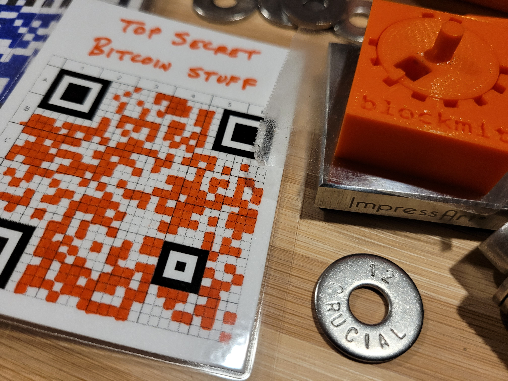
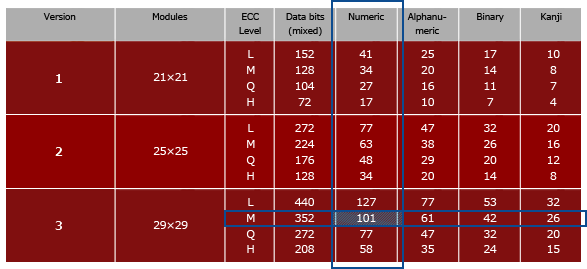
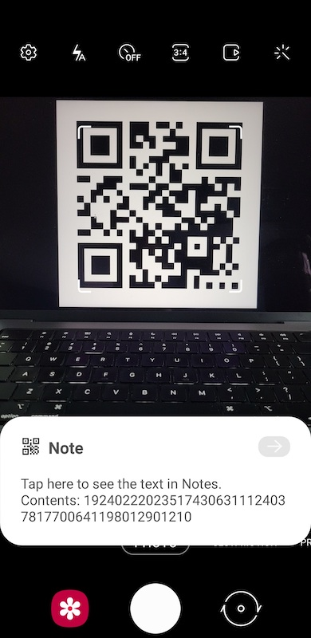
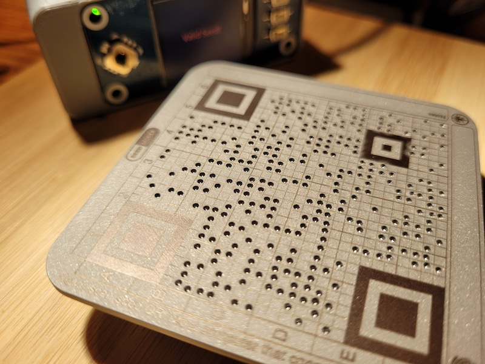
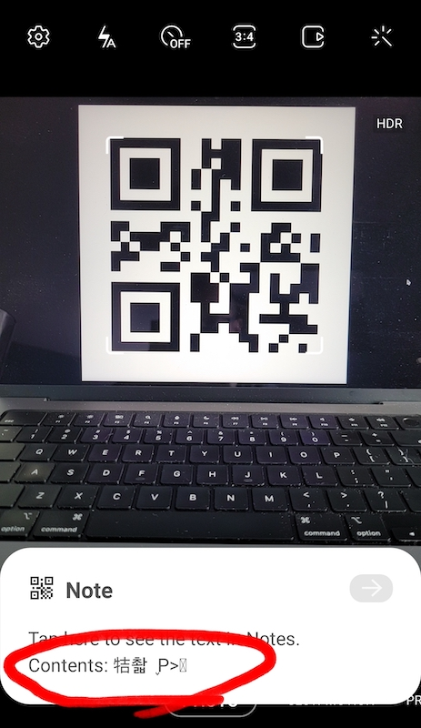
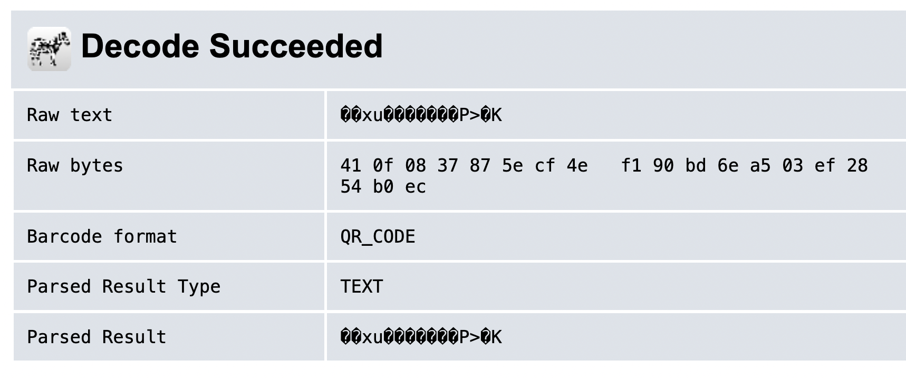

# SeedQR Format Specification

[SeedSigner](https://github.com/SeedSigner/seedsigner/) is an open source, DIY, fully-airgapped Bitcoin hardware wallet that wipes all private data from memory each time it's turned off. That means users need to re-enter their mnemonic seed phrase each time they use it.

To speed up this key entry process we have defined a way to encode a BIP-39 mnemonic seed phrase as a QR code that can be instantly scanned into a SeedSigner or potentially any other Bitcoin hardware wallet that has a camera.

The approach is specifically designed to encode the minimum possible amount of data in order to keep the resulting QR code small enough that it can be transcribed *by hand*. This sounds ridiculous at first, but remember that this is secret data that should never be stored in any digital medium. And even printers present some additional risk vectors.

<table align="center">
    <tr><td><br/><em>Obviously this SeedQR is just for demonstration purposes; never photograph your SeedQRs!</em></td></tr>
</table>


We have defined two QR formats:
* Standard SeedQR
* And a more advanced CompactSeedQR

Specifications for each follow below, as well as discussion of the pros and cons of each format.


## Quick Review of BIP-39 Mnemonic Seed Phrases
The typical method for backing up a Bitcoin wallet is to store its [BIP-39](https://github.com/bitcoin/bips/blob/master/bip-0039.mediawiki) mnemonic seed phrase consisting of 12 or 24 words.

Each word comes from a [list of 2048 words](https://github.com/bitcoin/bips/blob/master/bip-0039/english.txt). The words themselves are meaningless; all that matters is the word's position number (aka index) in the word list.

For example, "tomato" is the 1,825th word in the list.

But code always starts counting list items with zero. So the index of "tomato" is actually `1824` (if you're looking at the github wordlist line numbers, just remember to always subtract one).

So we can transcode a 12-word seed into a series of indices:

```
 1. vacuum    1924
 2. bridge     222
 3. buddy      235
 4. supreme   1743
 5. exclude    631
 6. milk      1124
 7. consider   378
 8. tail      1770
 9. expand     641
10. wasp      1980
11. pattern   1290
12. nuclear   1210
```

# "Standard" `SeedQR` Specification
We take the indices of the mnemonic seed phrase and concatenate them into one long stream of digits. Each index must be exactly four digits so shorter numbers must be zero-padded (`12` becomes `0012`).

Using the example above:

```bash
# with zero-padded indices:
1924 0222 0235 1743 0631 1124 0378 1770 0641 1980 1290 1210

# final assembled digit stream:
192402220235174306311124037817700641198012901210
```

This digit stream is then encoded into a QR code.


### QR Code Data Formats
It's important to note here that QR codes can encode data in a number of different ways:

<table align="center">
    <tr><td align="center"><br/><em><a href="https://www.qrcode.com/en/about/version.html">qrcode.com</a></em></td></tr>
</table>

QR codes are typically used to encode a website url, in which case the "Alphanumeric" format has to be used (the encoded data can consist of upper- and lowercase letters, numbers, and certain allowed symbols).

If you have a long url like `https://ohnoihavealongurl.com` (29 characters), the chart shows that it would not fit in a 21x21 QR code; its max capacity is 25 alphanumeric chars. But it's within the 47-char capacity of the 25x25 size.

### Bit efficiency matters
Notice that the "Numeric" column has greater capacity. This is because when you have fewer possible characters to encode, it takes less data to specify each one.

Alphanumeric format supports 44 possible characters. They are encoded as pairs, so that means there are 44^2 = 1,936 possible pairings to describe. Each pair can then be encoded using 11 bits:

```
2^11 = 2048
```

If you only used 10 bits, you could only specify 2^10 = 1,024 possible values; not nearly enough for the 1,936 possible pairings. 11 bits is the best this format can do.

The Numeric format is able to store 3 digits using just 10 bits. The largest possible 3-digit number is `999`, therefore 10 bits (2^10 = 1,024) is sufficient.

This is why a 25x25 QR code can only store 47 alphanumeric characters vs 77 numeric digits. It's the same amount of total data in terms of bits:

```
47 alphanumeric chars / 2 chars per pair * 11 bits per pair = 259 bits

77 numeric digits / 3 digits per group * 10 bits per group = 257 bits
```
*(both formats round up to 260 bits)*

Armed with this knowledge, we're ready to encode our SeedQR.


## Generate the SeedQR
Our SeedQR data will consist solely of numeric digits so that we can use the more efficient "Numeric" format. Our 12-word mnemonic seed phrase requires:

```
12 words * 4 digits per word = 48 digits
```

48 numeric digits won't fit in a 21x21 using the "L" (Low) error correction mode (max Numeric capacity is 41) but will easily fit in a 25x25:

<table align="center">
    <tr><td></td></tr>
</table>

If you scan this QR code with your phone, you'll see the human-readable digit stream:

<table align="center">
    <tr><td></td></tr>
</table>

And see for yourself that the digit stream matches what was generated above from the mnemonic seed word indices.

```
192402220235174306311124037817700641198012901210
```

At this point it is trivial for a SeedSigner or other Bitcoin hardware wallets to parse the digit stream back into the individual BIP-39 wordlist indices and rebuild your entire mnemonic seed phrase.

Looking back at the QR code capacity chart for Numeric data, we know exactly how large the resulting SeedQRs will be:
```
12-word mnemonic (48 digits) = 25x25
24-word mnemonic (96 digits) = 29x29
```

Examples:
<table align="center">
    <tr>
        <td align="center"><br/>12-word Standard SeedQR</td>
        <td align="center"><br/>24-word Standard SeedQR</td>
    </tr>
</table>


# `CompactSeedQR` Specification
The `CompactSeedQR` format builds upon the "Standard" `SeedQR` format by further optimizing how the data is stored in order to generate smaller QR codes that are easier to transcribe by hand.

Notice in the QR code capacity chart above that there's also a "Binary" column, but its relative capacity count initially looks pretty unimpressive; a 25x25 QR code is limited to 32.

But here the unit being described isn't alphanumeric characters or numeric digits; it's max number of bytes.

```
1 byte = 8 bits
```

Rather than having the QR format interpret our data as numbers or characters, we can directly encode the relevant bits that determine our mnemonic seed phrase.

We can extract exactly those bits from our mnemonic seed phrase digit stream that we generated above.

Let's bring back our mnemonic seed phrase's individual indices:

```bash
1924 0222 0235 1743 0631 1124 0378 1770 0641 1980 1290 1210
```

We know that the BIP-39 wordlist contains exactly 2048 words. That means we will need 11 bits to express each index in binary (2^11 = 2048; not a coincidence!):
```
1924 11110000100
0222 00011011110
0235 00011101011
1743 11011001111
0631 01001110111
1124 10001100100
0378 00101111010
1770 11011101010
0641 01010000001
1980 11110111100
1290 10100001010
1210 10010111010
```

We concatenate all those binary values to one large 132-bit stream:
```
111100001000001101111000011101011110110011110100111011110001100100001011110101101110101001010000001111101111001010000101010010111010
```

BIP-39 specifies a checksum word at the end of each mnemonic seed phrase. In a 12-word mnemonic, the last 4 bits are the checksum. In a 24-word mnemonic, the last 8 bits are the checksum.

The checksum is trivially calculated from the prior bits (in this case, the first 128 bits of our stream). Therefore we do not need to include those bits in our CompactSeedQR.

```
12-word mnemonic = 12 words * 11 bits per word = 132 bits
12-word CompactSeedQR = 132 bits - 4 checksum bits = 128 bits

24-word mnemonic = 24 words * 11 bits per word = 264 bits
24-word CompactSeedQR = 264 bits - 8 checksum bits = 256 bits
```

How well will these bit streams fit in a "Binary" QR code? Referring back to the QR code capacity chart we find the following for the "L" (Low) error correction mode:
```
12-word mnemonic: 128bits / 8 bits per byte = 16 bytes = 21x21

24-word mnemonic: 256bits / 8 bits per byte = 32 bytes = 25x25
```

So by using the optimally-efficient Binary encoding, we have made each CompactSeedQR one size smaller than its Standard SeedQR counterpart.

Examples:
<table align="center">
    <tr>
        <td align="center"><br/>12-word CompactSeedQR</td>
        <td align="center"><br/>24-word CompactSeedQR</td>
    </tr>
</table>


# Standard SeedQR vs CompactSeedQR

Here are the two formats side-by-side.

The same 12-word seed in each format:
<table align="center">
    <tr>
        <td align="center"><br/>Standard SeedQR (25x25)</td>
        <td align="center"><br/>CompactSeedQR (21x21)</td>
    </tr>
</table>

The same 24-word seed in each format:
<table align="center">
    <tr>
        <td align="center"><br/>Standard SeedQR (29x29)</td>
        <td align="center"><br/>CompactSeedQR (25x25)</td>
    </tr>
</table>

Since the goal of the SeedQR concept is to make it easy to transcribe by hand, it's natural to assume that the CompactSeedQR is better.

Let's compare actual "real estate" in each size. All of our QR sizes have three large 8x8 registration blocks in the corners. 29x29 and 25x25 have a smaller 5x5 registration block in the lower right.

```
29x29 - (3*8x8) - 5x5 = 624 blocks
25x25 - (3*8x8) - 5x5 = 408 blocks
21x21 - (3*8x8)       = 249 blocks
```

So by shrinking a 24-word Standard SeedQR from 29x29 down to a CompactSeedQR at 25x25, we've reduced the area we have to manually transcribe to:

```
408 / 624 = 65%
```

And similarly, shrinking a 12-word 25x25 Standard SeedQR down to a CompactSeedQR at 21x21:

```
249 / 408 = 61%
```

If you're manually punching holes into a metal SeedQR plate, that's cutting out about 35-40% of the work!

<table align="center">
    <tr><td></td></tr>
</table>

But there are other tradeoffs to consider.

## Recoverability
If you lose your SeedSigner or somehow the project is abandoned or banned, how will you read back your SeedQR? 

With the Standard SeedQR format this is trivial--any smartphone can decode the numeric digit stream. But the CompactSeedQR's raw byte data is not decipherable in the same way. Most QR readers today assume the data is either alphanumeric or human-readable numeric data. Because of this assumption, they misinterpret the binary format data:

<table align="center">
    <tr>
        <td align="center"><br/>Standard SeedQR</td>
        <td align="center"><br/>CompactSeedQR</td>
    </tr>
</table>

The clearly readable Standard SeedQR digit stream can be manually transcribed back to a mnemonic seed phrase with no other computer assistance, if need be.

It's just the above process in reverse:
```bash
# 12-word Standard SeedQR digit stream
192402220235174306311124037817700641198012901210

# Separate out into 4-digit individual indices
1924 0222 0235 1743 0631 1124 0378 1770 0641 1980 1290 1210

# Look up each BIP-39 index number (index+1 if using the github list!)
 1. vacuum    1924
 2. bridge     222
 3. buddy      235
 4. supreme   1743
 5. exclude    631
 6. milk      1124
 7. consider   378
 8. tail      1770
 9. expand     641
10. wasp      1980
11. pattern   1290
12. nuclear   1210
```

It would be much more difficult to manually recreate your seed from a CompactSeedQR. Tools like [zxing.org](https://zxing.org/w/decode.jspx) or [ZBar](https://zbar.sourceforge.net/) can help you get the binary data out as a hexidecimal string:



Note that for some QR decoders, zxing in particular, may return more data than the compact seed itself: the data type, the data length, and padding.  For example, the zxing result from 12-word CompactSeedQRs in low error correction mode will start with `41 0` (that specifies the binary data format and says the length of the data is 16 bytes) and end with `0 ec` (unused byte and a half). Similarly, 24-word CompactSeedQRs will start with `42 0` (binary, data length is 32 bytes) and end with `0` (unused half a byte).

The ZBar library just returns the encoded data, without metadata or padding.

## Obfuscation
Conversely, having limited support for reading binary QR codes and the complications described above are seen by some as an added security feature. Should someone steal your CompactSeedQR or take a photo of it, they'll have to be fairly savvy to know how to decode it.


# Some Additional Notes on QR Codes
Our main use case is to be able to quickly initialize a SeedSigner with your mnemonic seed phrase. But using a QR code as your key loader--or even as your permanent backup etched in metal--has other advantages.

QR codes are ubiquitous now so plenty of hardware and software exists to read and generate them.

QR codes have built-in error correction. The "L" error correction mode is described as having a roughly 7% correction rate.

In general, QR codes are incredibly resilient to unreadable blocks. For example, you often see the middle blocks intentionally covered over with a logo:

<table align="center"><tr><td></td></tr></table>

This is right at the limit of SeedSigner's ability to read this 24-word SeedQR, despite the inaccessible blocks.

Similarly, QR codes can withstand human error during the manual transcription process. A few mis-coded blocks, a smeared ink blob, or other physical blemishes will generally not cause any problems.


# Test SeedQRs
Sample test vectors to verify your own encode and decode implementations:

---

## Test Vector 1: 24-word seed
```bash
# 24-word seed:
attack pizza motion avocado network gather crop fresh patrol unusual wild holiday candy pony ranch winter theme error hybrid van cereal salon goddess expire

# Standard SeedQR digit stream:
011513251154012711900771041507421289190620080870026613431420201617920614089619290300152408010643

# CompactSeedQR bitstream:
0000111001110100101101100100000100000111111110010100110011000000110011001111101011100110101000010011110111001011111011000011011001100010000101010100111111101100011001111110000011100000000010011001100111000000011110001001001001011001011111010001100100001010

# CompactSeedQR bytestream:
b'\x0et\xb6A\x07\xf9L\xc0\xcc\xfa\xe6\xa1=\xcb\xec6b\x15O\xecg\xe0\xe0\t\x99\xc0x\x92Y}\x19\n'
```

<table align="center">
    <tr>
        <td align="center"><br/>Standard SeedQR</td>
        <td align="center"><br/>CompactSeedQR</td>
    </tr>
</table>

---

## Test Vector 2: 24-word seed
Note that this vector and a few others below include a null byte character (`\x00`) in its CompactSeedQR bytestream. This is a particularly troublesome character for most QR readers; most will read this character as an instruction to stop reading any further data.

Take extra care to confirm that your implementation correctly reads these characters and all remaining data after it!

```bash
# 24-word seed:
atom solve joy ugly ankle message setup typical bean era cactus various odor refuse element afraid meadow quick medal plate wisdom swap noble shallow

# Standard SeedQR digit stream:
011416550964188800731119157218870156061002561932122514430573003611011405110613292018175411971576

# CompactSeedQR bitstream:
0000111001011001110111011110001001110110000000001001001100010111111100010010011101011111000100111000100110001000100000000111100011001001100100110110100011010001111010000010010010001001101101011111011000101001010100110001111111000101101101101010010101101110

# CompactSeedQR bytestream:
b"\x0eY\xdd\xe2v\x00\x93\x17\xf1'_\x13\x89\x88\x80x\xc9\x93h\xd1\xe8$\x89\xb5\xf6)S\x1f\xc5\xb6\xa5n"
```

<table align="center">
    <tr>
        <td align="center"><br/>Standard SeedQR</td>
        <td align="center"><br/>CompactSeedQR</td>
    </tr>
</table>

---

## Test Vector 3: 24 word seed
```bash
# 24-word seed:
sound federal bonus bleak light raise false engage round stock update render quote truck quality fringe palace foot recipe labor glow tortoise potato still

# Standard SeedQR digit stream:
166206750203018810361417065805941507171219081456140818651401074412730727143709940798183613501710

# CompactSeedQR bitstream:
1100111111001010100011000110010110001011110010000001100101100010010101001001001001010010101111000111101011000011101110100101101100001011000000011101001001101011110010101110100010011111001010110101111011001110101111100010011000111101110010110010101000110110

# CompactSeedQR bytestream:
b'\xcf\xca\x8ce\x8b\xc8\x19bT\x92R\xbcz\xc3\xba[\x0b\x01\xd2k\xca\xe8\x9f+^\xce\xbe&=\xcb*6'
```

<table align="center">
    <tr>
        <td align="center"><br/>Standard SeedQR</td>
        <td align="center"><br/>CompactSeedQR</td>
    </tr>
</table>

---

## Test Vector 4: 12-word seed
```bash
# 12-word seed:
forum undo fragile fade shy sign arrest garment culture tube off merit

# Standard SeedQR digit stream:
073318950739065415961602009907670428187212261116

# CompactSeedQR bitstream:
01011011101111011001110101110001101010001110110001111001100100001000001100011010111111110011010110011101010000100110010101000101

# CompactSeedQR bytestream:
b'[\xbd\x9dq\xa8\xecy\x90\x83\x1a\xff5\x9dBeE'
```

<table align="center">
    <tr>
        <td align="center"><br/>Standard SeedQR</td>
        <td align="center"><br/>CompactSeedQR</td>
    </tr>
</table>

---

## Test Vector 5: 12-word seed
```bash
# 12-word seed:
good battle boil exact add seed angle hurry success glad carbon whisper

# Standard SeedQR digit stream:
080301540200062600251559007008931730078802752004

# CompactSeedQR bitstream:
01100100011000100110100001100100001001110010000000110011100001011100001000110011011111011101100001001100010100001000100111111101

# CompactSeedQR bytestream:
b"dbhd' 3\x85\xc23}\xd8LP\x89\xfd"
```

<table align="center">
    <tr>
        <td align="center"><br/>Standard SeedQR</td>
        <td align="center"><br/>CompactSeedQR</td>
    </tr>
</table>

---

## Test Vector 6: 12-word seed
```bash
# 12-word seed:
approve fruit lens brass ring actual stool coin doll boss strong rate

# Standard SeedQR digit stream:
008607501025021714880023171503630517020917211425

# CompactSeedQR bitstream:
00001010110010111011101000000000100011011001101110100000000001011111010110011001011010110100000010100011010001110101110011011001

# CompactSeedQR bytestream:
b'\n\xcb\xba\x00\x8d\x9b\xa0\x05\xf5\x99k@\xa3G\\\xd9'
```

<table align="center">
    <tr>
        <td align="center"><br/>Standard SeedQR</td>
        <td align="center"><br/>CompactSeedQR</td>
    </tr>
</table>

---

## Test Vectors 7-9: Additional Compact SeedQR problem characters
Explicitly check Compact SeedQRs whose byte stream contains `\n`, `\r`, or `\r\n`:

`\n`:
```bash
# 12-word seed:
dignity utility vacant shiver thought canoe feel multiply item youth actor coyote

# Standard SeedQR digit stream:
049619221923158517990268067811630950204300210397

# CompactSeedQR bitstream:
00111110000111100000101111000001111000110001111000001110010000110001010100110100100010110111011011011111111011000000101010011000

# CompactSeedQR bytestream:
b'>\x1e\x0b\xc1\xe3\x1e\x0eC\x154\x8bv\xdf\xec\n\x98'
```

<table align="center">
    <tr>
        <td align="center"><br/>CompactSeedQR</td>
    </tr>
</table>


`\r`:
```bash
# 12-word seed:
corn voice scrap arrow original diamond trial property benefit choose junk lock

# Standard SeedQR digit stream:
038719631547010112530489185713790169032209701051

# CompactSeedQR bitstream:
00110000011111101010111100000101100001100101100111001010011110100111101000001101011000110001010100100101000010011110010101000001

# CompactSeedQR bytestream:
b'0~\xaf\x05\x86Y\xcazz\rc\x15%\t\xe5A'
```

<table align="center">
    <tr>
        <td align="center"><br/>CompactSeedQR</td>
    </tr>
</table>


`\r\n`:
```bash
# 12-word seed:
vocal tray giggle tool duck letter category pattern train magnet excite swamp

# Standard SeedQR digit stream:
196218530783182905421028028912901848107106301753

# CompactSeedQR bitstream:
11110101010111001111010110000111111100100101010000111101000000010000100100001101000010101110011100010000101111010011101101101101

# CompactSeedQR bytestream:
b'\xf5\\\xf5\x87\xf2T=\x01\t\r\n\xe7\x10\xbd;m'
```

<table align="center">
    <tr>
        <td align="center"><br/>CompactSeedQR</td>
    </tr>
</table>
