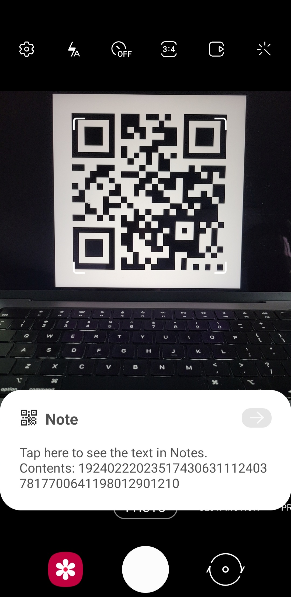

# SeedQR Format Specification

[SeedSigner](https://github.com/SeedSigner/seedsigner/) is an open source, DIY, fully-airgapped Bitcoin hardware wallet that wipes all private data from memory each time it's turned off. That means users need to re-enter their Bitcoin private key each time they use it.

To speed up this key entry process we have defined a way to encode a private key as a QR code that can be instantly scanned into a SeedSigner or potentially any other Bitcoin hardware wallet that has a camera.

The approach is specifically designed to encode the minimum possible amount of data in order to keep the resulting QR code small enough that it can be transcribed *by hand*. This sounds ridiculous at first, but remember that this is secret data that should never be stored in any digital medium. And even printers present some additional risk vectors.


*Obviously this SeedQR is just for demonstration purposes; never photograph your SeedQRs!*


We have defined two QR formats:
* Standard SeedQR
* And a more advanced CompactSeedQR

Specifications for each follow below, as well as discussion of the pros and cons of each format.

## Quick Review of BIP-39 Mnemonic Seed Phrases
The typical method for backing up a Bitcoin private key is to store it as a [BIP-39](https://github.com/bitcoin/bips/blob/master/bip-0039.mediawiki) mnemonic seed phrase that consists of 12 or 24 words.

Each word comes from a [list of 2048 words](https://github.com/bitcoin/bips/blob/master/bip-0039/english.txt). The words themselves are meaningless; all that matters is the word's position number (aka index) in the word list.

For example, "tomato" is the 1,825th word in the list.

But code always starts counting list items with zero. So the index of "tomato" is actually `1824` (if you're looking at the github wordlist line numbers, just remember to always subtract one).

So we can transcode a 12-word seed into a series of indices:

```
 1. vacuum    1924
 2. bridge     222
 3. buddy      235
 4. supreme   1743
 5. exclude    631
 6. milk      1124
 7. consider   378
 8. tail      1770
 9. expand     641
10. wasp      1980
11. pattern   1290
12. nuclear   1210
```

# "Standard" `SeedQR` Specification
We take the indices of the mnemonic seed phrase and concatenate them into one long stream of digits. Each index must be exactly four digits so shorter numbers must be zero-padded (`12` becomes `0012`).

Using the example above:

```bash
# with zero-padded indices:
1924 0222 0235 1743 0631 1124 0378 1770 0641 1980 1290 1210

# final assembled digit stream:
192402220235174306311124037817700641198012901210
```

This digit stream is then encoded into a QR code.


### QR Code Data Formats
It's important to note here that QR codes can encode data in a number of different ways:


*from: [https://www.qrcode.com/en/about/version.html](https://www.qrcode.com/en/about/version.html)*

QR codes are typically used to encode a website url, in which case the "Alphanumeric" format has to be used (the encoded data can consist of upper- and lowercase letters, numbers, and certain allowed symbols).

If you have a long url like `https://ohnoihavealongurl.com` (29 characters), the chart shows that it would not fit in a 21x21 QR code; its max capacity is 25 alphanumeric chars. But it's within the 47-char capacity of the 29x29 size.

### Bit efficiency matters
Notice that the "Numeric" column has greater capacity. This is because when you have fewer possible characters to encode, it takes less data to specify each one.

Alphanumeric format supports 44 possible characters. They are encoded as pairs, so that means there are 44^2 = 1,936 possible pairings to describe. Each pair can then be encoded using 11 bits:

```
2^11 = 2048
```

If you only used 10 bits, you could only specify 2^10 = 1,024 possible values; not nearly enough for the 1,936 possible pairings. 11 bits is the best this format can do.

The Numeric format is able to store 3 digits using just 10 bits. The largest possible 3-digit number is `999`, therefore 10 bits (2^10 = 1,024) is sufficient.

This is why a 25x25 QR code can only store 47 alphanumeric characters vs 77 numeric digits. It's the same amount of total data in terms of bits:

```
47 alphanumeric chars / 2 chars per pair * 11 bits per pair = 259 bits

77 numeric digits / 3 digits per group * 10 bits per group = 257 bits
```
*(both formats round up to 260 bits)*

Armed with this knowledge, we're ready to encode our SeedQR.


## Generate the SeedQR
Our SeedQR data will consist solely of numeric digits so that we can use the more efficient "Numeric" format. Our 12-word mnemonic seed phrase requires:

```
12 words * 4 digits per word = 48 digits
```

48 numeric digits won't fit in a 21x21 (max Numeric capacity is 41) but will easily fit in a 25x25:


If you scan this QR code with your phone, you'll see the human-readable digit stream:



And see for yourself that the digit stream matches what was generated above from the mnemonic seed word indices.

```
192402220235174306311124037817700641198012901210
```

At this point it is trivial for a SeedSigner or other Bitcoin hardware wallets to parse the digit stream back into the individual BIP-39 wordlist indices and rebuild your entire mnemonic seed phrase.

Looking back at the QR code capacity chart for Numeric data, we know exactly how large the resulting SeedQRs will be:
```
12-word mnemonic (48 digits) = 25x25
24-word mnemonic (96 digits) = 29x29
```

# `CompactSeedQR` Specification
The `CompactSeedQR` format builds upon the "Standard" `SeedQR` format by further optimizing how the data is stored in order to generate smaller QR codes that are easier to transcribe by hand.

Notice in the QR code capacity chart above that there's also a "Binary" column, but its relative capacity count initially looks pretty unimpressive; a 25x25 QR code is limited to 32.

But here the unit being described isn't alphanumeric characters or numeric digits; it's max number of bytes.

```
1 byte = 8 bits
```

Rather than having the QR format interpret our data as numbers or characters, we can directly encode the relevant bits that determine our Bitcoin private key.

We can extract exactly those bits from our mnemonic seed phrase digit stream that we generated above.

Let's bring back our mnemonic seed phrase's individual indices:

```bash
1924 0222 0235 1743 0631 1124 0378 1770 0641 1980 1290 1210
```

We know that the BIP-39 wordlist contains exactly 2048 words. That means we will need 11 bits to express each index in binary (2^11 = 2048; not a coincidence!):
```
1924 11110000100
0222 00011011110
0235 00011101011
1743 11011001111
0631 01001110111
1124 10001100100
0378 00101111010
1770 11011101010
0641 01010000001
1980 11110111100
1290 10100001010
1210 10010111010
```

We concatenate all those binary values to one large 132-bit stream:
```
111100001000001101111000011101011110110011110100111011110001100100001011110101101110101001010000001111101111001010000101010010111010
```

BIP-39 specifies a checksum word at the end of each mnemonic seed phrase. In a 12-word mnemonic, the last 4 bits are the checksum. In a 24-word mnemonic, the last 8 bits are the checksum.

The checksum is trivially calculated from the prior bits (in this case, the first 128 bits of our stream). Therefore we do not need to include those bits in our CompactSeedQR.

```
12-word mnemonic = 12 words * 11 bits per word = 132 bits
12-word CompactSeedQR = 132 bits - 4 checksum bits = 128 bits

24-word mnemonic = 24 words * 11 bits per word = 264 bits
24-word CompactSeedQR = 264 bits - 8 checksum bits = 256 bits
```

How well will these bit streams fit in a "Binary" QR code? Referring back to the QR code capacity chart we find:
```
12-word mnemonic: 128bits / 8 bits per byte = 16 bytes = 21x21

24-word mnemonic: 256bits / 8 bits per byte = 32 bytes = 25x25
```

So by using the optimally-efficient Binary encoding, we have made each CompactSeedQR one size smaller than its Standard SeedQR counterpart.
