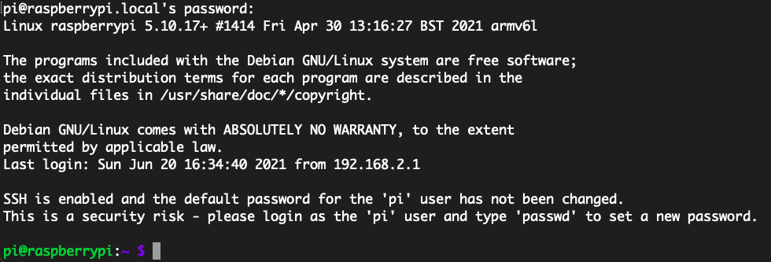
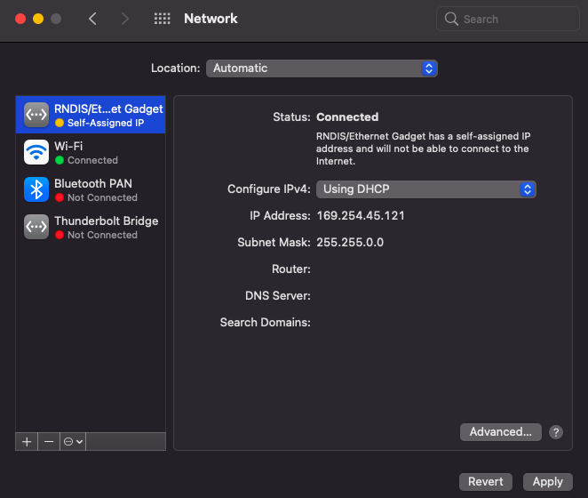
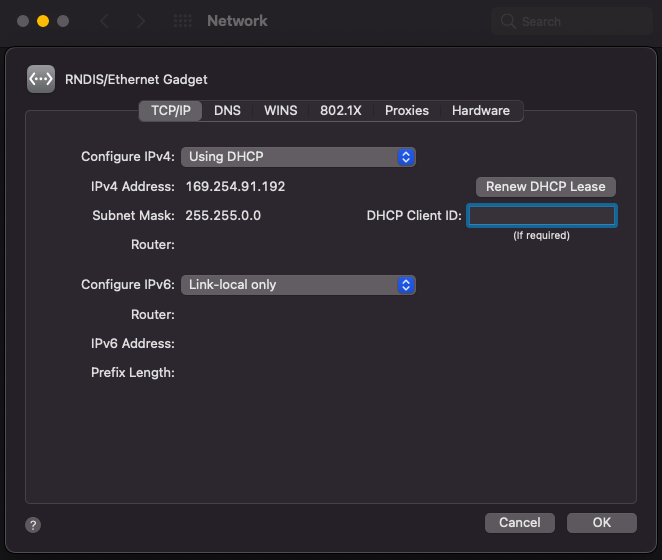
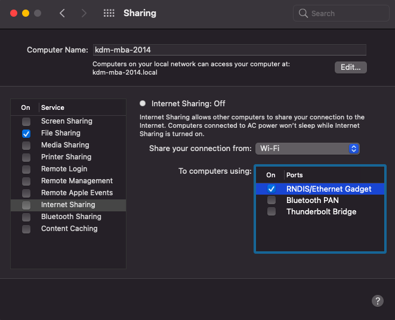
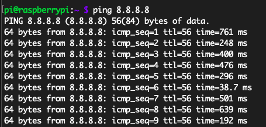
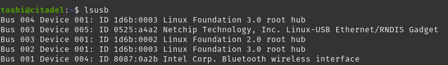
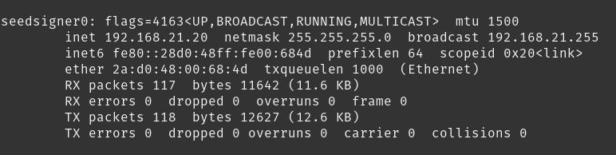

## Relaying internet access to the Pi Zero 1.3 over USB

Note that this is an optional, alternate way to initialize your SeedSigner. The default method is to work on a separate Raspberry Pi device that has internet access. Be aware that by enabling internet access over USB you are obviously creating a link to the outside world that this project seeks to avoid.

If you use this setup route, we recommend that you disable internet access over USB when these steps are complete.


### Get started

Insert the SD card with your Raspberry Pi OS image into a regular computer. Open a terminal window (macOS: Terminal; Windows: Command Prompt) and navigate to the SD card:
```
# mac/Linux:
cd /Volumes/boot

# Windows (alter with correct drive letter):
cd e:
```

We need to create an empty file called "ssh" to enable us to remotely terminal into the Pi via SSH.
```
# mac/Linux:
touch ssh

# Windows:
type nul > ssh
```


Now we have some incomprehensible configuration steps to set up the internet access relay.

Edit `config.txt`:
```
# mac/Linux:
nano config.txt

# Windows:
notepad config.txt
```

Add `dtoverlay=dwc2` to the end of `config.txt`. Exit and save changes (CTRL-X, then "y" in nano).


Alternatively, add to `config.txt` via the command line:
```
# mac/Linux/Windows:
echo dtoverlay=dwc2 >> config.txt
```


Next, edit `cmdline.txt`:
```
# mac/Linux:
nano cmdline.txt

# Windows:
notepad cmdline.txt
```

Add `modules-load=dwc2,g_ether` **directly after** `rootwait`:
```
blah blah rootwait modules-load=dwc2,g_ether [possibly more blah]
```

Exit and save changes (CTRL-X, then "y" in nano).

If you are on Linux, you need to first [set a static IP](#set-a-static-ip-on-linux) for both your Pi Zero 1.3 and your host computer. Otherwise, continue with the steps below.

Eject the SD card and insert it into your Pi Zero 1.3. Plug a USB cable into your computer and into the Pi's USB connector that is closer to the center. It will draw power from the USB cable and begin powering up.

The Pi will take a minute or so to boot up its OS. After waiting a bit, try to communicate with the Pi over SSH:
```
# Manual builds:
ssh pi@raspberrypi.local

# Pre-built image:
ssh pi@seedsigner.local
```

If you see the following prompt, type `yes` to continue:
```
The authenticity of host 'raspberrypi.local (192.168.2.3)' can't be established.
ECDSA key fingerprint is SHA256:go4yVgii1GcvyxzhOe03atLn5bl2NhZlOR04tJHBo+k.
Are you sure you want to continue connecting (yes/no/[fingerprint])?
```

At the password prompt enter the Pi's default password: `raspberry`

If you now see the Pi's command prompt, you're in!



Notice this warning in particular:
```
SSH is enabled and the default password for the 'pi' user has not been changed.
This is a security risk - please login as the 'pi' user and type 'passwd' to set a new password.
```

If someone savvy got access to your SeedSigner, they could sign into it and potentially upload malicious code. To add an extra layer of protection, change the default 'pi' user's password now by typing `passwd`:
```
pi@raspberrypi:~ $ passwd
Changing password for pi.
Current password: 
New password: 
Retype new password: 
passwd: password updated successfully
```


## Configure host computer to share internet access with the Pi

### macOS
Open the "Network" system settings. You should see an entry called "RNDIS/Ethernet Gadget":



Click "Advanced" and change "Configure IPv6" to "Link-local only":



Click "OK" and save your changes.

Now go to the "Sharing" system settings. Click on "Internet Sharing" and check the "RNDIS/Ethernet Gadget". 



Click the "Internet Sharing" checkbox to activate.

Back at your SSH terminal, test the connection:
```
ping 8.8.8.8
```

_Hit `CTRL-C` to abort the ping_

If you see a ping response, the Pi has internet access!




### Windows
see: https://www.circuitbasics.com/raspberry-pi-zero-ethernet-gadget/


### Linux
To enable IP forwarding on your Host:
```
nano /etc/sysctl.conf
```

and uncomment the following line:
```
net.ipv4.ip_forward = 1
```

Then run `sudo sysctl -p` to have immediate effect.

You should now be able to SSH into your internet connected Pi Zero 1.3, as described in the ["Get started"](#get-started) section.


## Set a static IP on Linux
_This guide is intended for Debian/Ubuntu based distros._

In order to set up the connection between your computer and the Pi Zero, you will have to set a static IP on both endpoints of the connection.

What you will need:

* `def_iface` is the Iface of the "default" Destination network. On your __Host__ machine, type `route` to find it.
* `host_ip` is the IP address of your Host on the USB interface. For this guide we will use `192.168.21.20`
* `rpi_ip` is the IP address of your Pi Zero on the USB interface. Use `192.168.21.21`

_Note: Remember to remove the brackets. For example, `ip_address=<rpi_ip>` should be written as: `ip_address=192.168.21.21`_

#### On the SD card
```
cd rootfs/etc
nano dhcpcd.conf
```
At the end of the file, add the following lines.
```
interface usb0
static ip_address=<rpi_ip>/24
static routers=<host_ip>
static domain_name_servers=8.8.8.8 8.8.4.4
```

Eject the SD card and insert it into your Pi Zero 1.3. Plug a USB cable into your computer and into the Pi's USB connector that is closer to the center. It will draw power from the USB cable and begin powering up. 

#### On the Host machine

Type `lsusb` to see if your Pi Zero is properly connected. Look for `Ethernet/RNDIS Gadget`:



Set a name for your new Interface:
```
nano /etc/systemd/network/10-rename-rpi0.link
```

Now paste in the following text:
```
[Match]
Property=ID_VENDOR_ID=0525 "ID_MODEL_ID=a4a2"
[Link]
Name=seedsigner0
```

To give your Host a static ip:
```
nano /etc/network/interfaces.d/seedsigner
```

Now paste in the following text:
```
auto seedsigner0
iface seedsigner0 inet static
address <host_ip>
netmask 255.255.255.0
post-up /sbin/iptables -t nat -A POSTROUTING -o <def_iface> -j MASQUERADE
```

Reboot your computer.

To see if everything is set up correctly, type `ifconfig` and look for the `seedsigner0` interface. It should have the <host_ip> assigned to it. 



Continue by configuring your host computer to [share internet access](#linux) with your Pi Zero.


## Complete the setup
Return to the main [README](../README.md) and complete the setup steps. But remember to come back here and disable internet access over USB on your SeedSigner.


## Disable internet access
Power down the SeedSigner and remove the SD card. Put the SD card back into your computer and use a terminal to navigate to the `boot` drive (same process as above).

Edit `config.txt`:
```
# mac/Linux:
nano config.txt

# Windows:
notepad config.txt
```

Delete the `dtoverlay=dwc2` line that we added to the end of the file. Exit and save changes (CTRL-X, then "y" in nano).


Edit `cmdline.txt`:
```
# mac/Linux:
nano cmdline.txt

# Windows:
notepad cmdline.txt
```

Delete `modules-load=dwc2,g_ether`. Exit and save changes (CTRL-X, then "y" in nano).

Eject the SD card and put it back in the SeedSigner. Connect the SeedSigner to your computer with a USB cable. It should no longer show up as a "RNDIS/Ethernet Gadget".

SSH into the pi and try to `ping 8.8.8.8`. It should fail with no responses.

For full security, put the SD card back in your computer one last time and delete the `ssh` file from `boot`:
```
# mac/Linux:
rm ssh

# Windows:
del ssh
```

You're now good to go with a SeedSigner that is back to being fully air-gapped!