# The Push Case

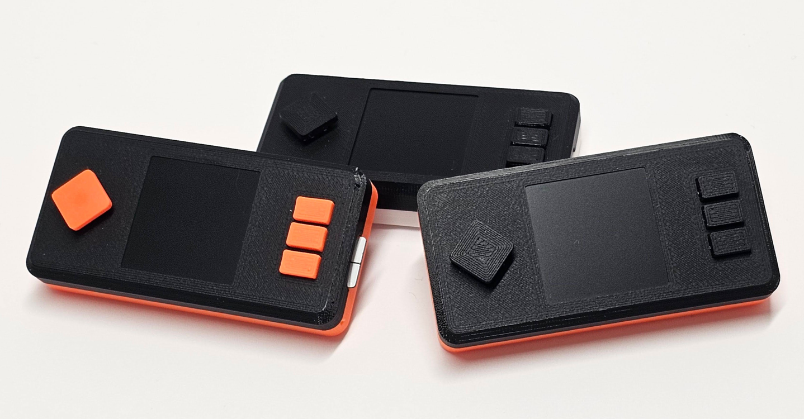

Designer: @kayth21

## Motivation

The motivation for this design was to get a thin, screwless and good looking enclosure with minimal secondary hardware requirements.

## Characterisics

- No screws needed
- Soldering required
- Mini-HDMI port not accessible
- Removeable memory card accessible
- Data-enabled USB port not accessible

## Hardware restrictions

- Raspberry Pi Zero without pre-installed GPIO pins required.
- Raspberry Pi Camera in smaller "Zero" style version required.

## Secondary hardware requirements

- 40x pins (6mm / 0.04in)
- Soldering iron and solder

## 3D prints and screwless design

Please note that the prints must be accurate in order to fit tightly without screws and for the buttons to perform smoothly. The prints are well tested with a Prusa MK3s (.3mf files attached), Prusament PLA and hardware components from early 2024. With this setup, the enclosure holds strongly together, but can still be opened again with a little effort (although this is not recommended, as it may not hold together as tightly afterwards). Other printers or newer or older hardware may produce results that do not fit and in worst case damage the hardware.

## Known issues

- Bambu Studio Slicer: There is a strange problem when slicing the buttons. A few layers are missing. As a workaround you can use another slicer, e.g. the Prusa Slicer.

## Assembly

### 1. Get all the parts

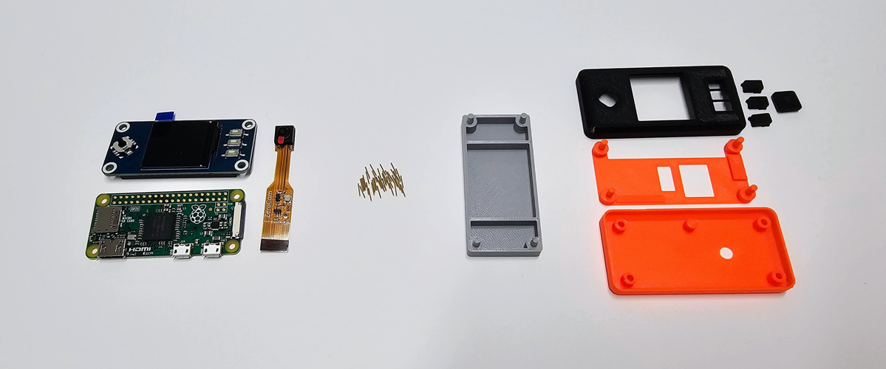

- Raspberry Pi Zero v.1.3
- Waveshare LCD Display (240x240)
- Camera for Raspberry Pi Zero
- 40 pins (6mm / 0.04in, cut them to size if you can only find larger ones)
- Soldering iron and solder (not on picture)
- Soldering support (3D print)
- Top, middle, back and buttons (3D prints)
- Tweezers (if available - not on picture)

### 2. Place the display and the Raspberry Pi on the soldering support

	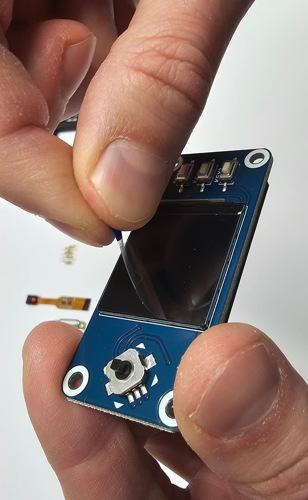
	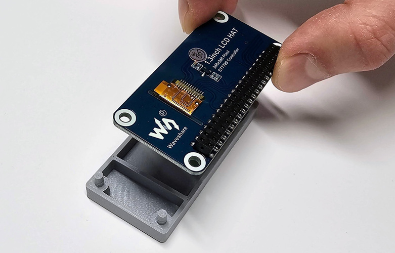
	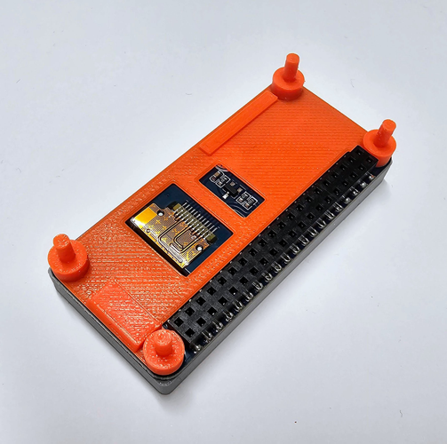
	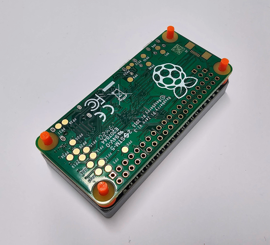

- Remove the screen protection of the LCD display.
- Place the display face down on the soldering support.
- Place the middle support on the display.
- Place the Raspberry Pi face down on the middle support.

### 3. Solder the pins

	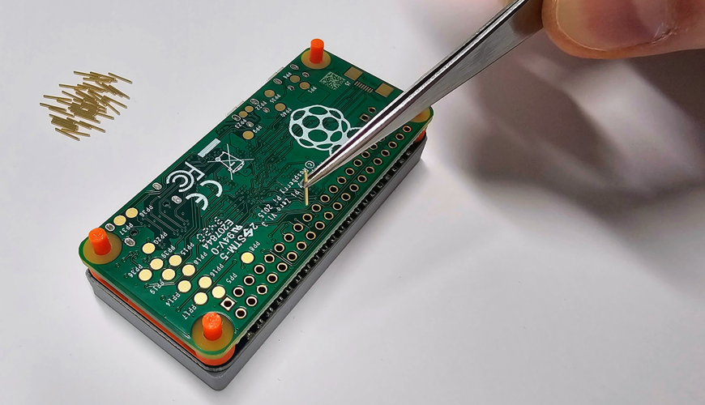
	
	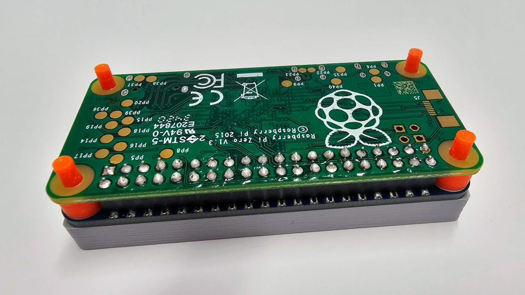

- Insert the 40 pins with the help of tweezers and push them all the way down.
- Solder the pins (please pay attention not to melt the orange support elements!).
- Optional: Pull out the Raspberry Pi to check that the pins are holding properly after soldering. 

### 4. Attach camera

	
	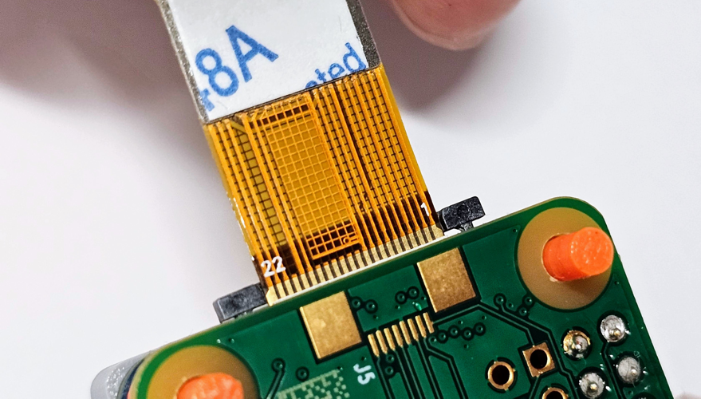
	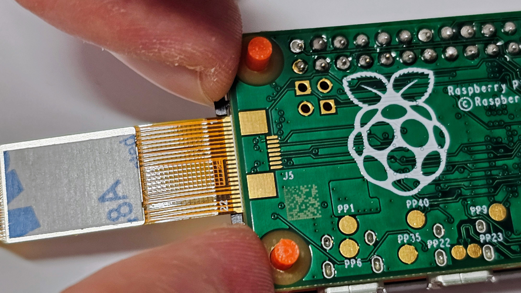

- Carefully pull out the camera cable mount (ideally with the support of a tool).
- Plug in the camera cable (it doesn't go very deep).
- Close the camera cable mount to fix the cable.

### 5. Stick on the back part

	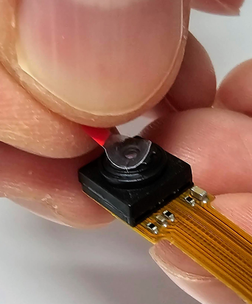
	
	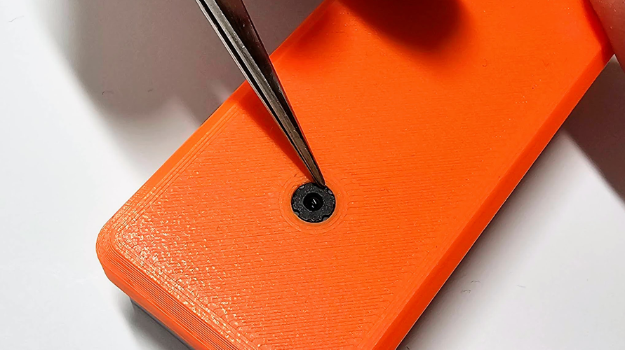

- Remove the camera protection.
- Bend the camera cable into position (do not use the adhesive tape!).
- Place the back part on the signer, but do not push it in completely yet.
- Align the camera precisely with the help of a tool.
- Push the back part in completely (the camera should fit perfectly and have no more play).

### 6. Stick on the front part

	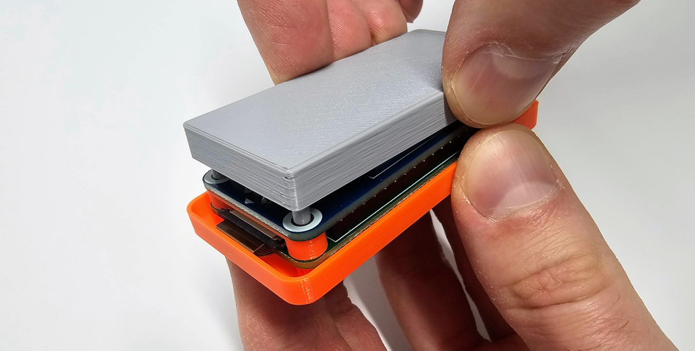
	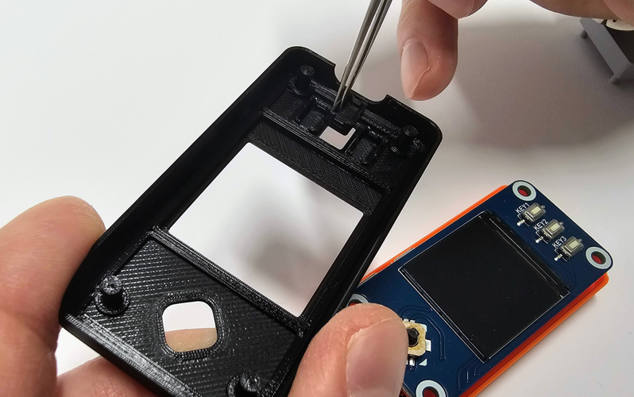
	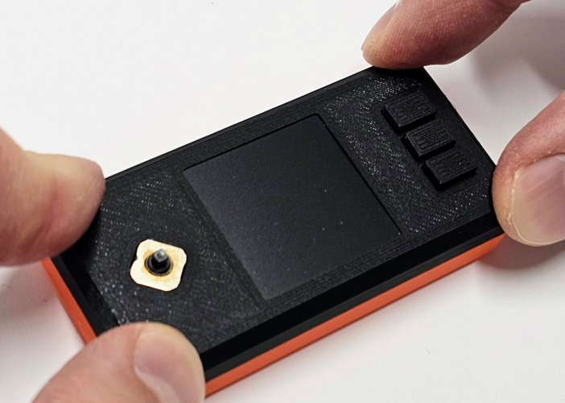
	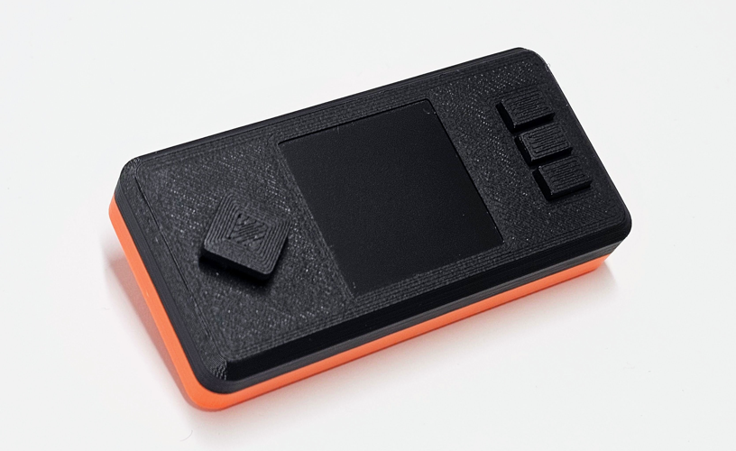

- Remove the soldering support.
- Insert the 3 buttons into the front. 
- Press the front completely into the signer (hold the device upside down so that the buttons do not fall out).
- Plug in the thumbstick.

### 7. Flash a MicroSD card

- Please follow the documentation on [SeedSigner.com](https://seedsigner.com).
